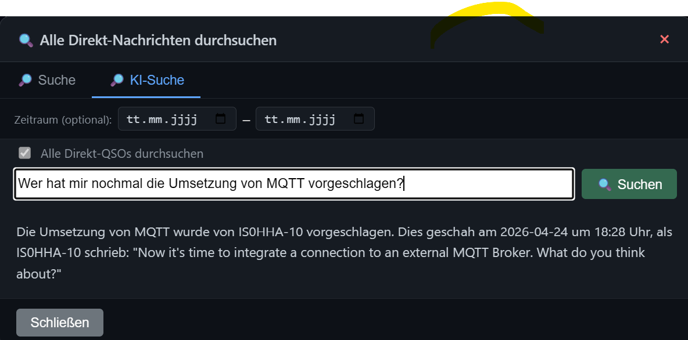

```
  ███╗   ███╗███████╗███████╗██╗  ██╗ ██████╗ ██████╗ ███╗   ███╗
  ████╗ ████║██╔════╝██╔════╝██║  ██║██╔════╝██╔═══██╗████╗ ████║
  ██╔████╔██║█████╗  ███████╗███████║██║     ██║   ██║██╔████╔██║
  ██║╚██╔╝██║██╔══╝  ╚════██║██╔══██║██║     ██║   ██║██║╚██╔╝██║
  ██║ ╚═╝ ██║███████╗███████║██║  ██║╚██████╗╚██████╔╝██║ ╚═╝ ██║
  ╚═╝     ╚═╝╚══════╝╚══════╝╚═╝  ╚═╝ ╚═════╝ ╚═════╝ ╚═╝     ╚═╝
    ██╗    ██╗███████╗██████╗ ██████╗ ███████╗███████╗██╗  ██╗
    ██║    ██║██╔════╝██╔══██╗██╔══██╗██╔════╝██╔════╝██║ ██╔╝
    ██║ █╗ ██║█████╗  ██████╔╝██║  ██║█████╗  ███████╗█████╔╝
    ██║███╗██║██╔══╝  ██╔══██╗██║  ██║██╔══╝  ╚════██║██╔═██╗
    ╚███╔███╔╝███████╗██████╔╝██████╔╝███████╗███████║██║  ██╗
     ╚══╝╚══╝ ╚══════╝╚═════╝ ╚═════╝ ╚══════╝╚══════╝╚═╝  ╚═╝
```

# MeshCom WebDesk

A **Blazor Server** web application for communicating with a [MeshCom 4.0](https://icssw.org/meshcom/) node via UDP (EXTUDP JSON protocol).  
Built with **.NET 10** and **Blazor Interactive Server**.

> **MeshCom Firmware:** Compatible with [icssw-org/MeshCom-Firmware](https://github.com/icssw-org/MeshCom-Firmware) v4.35+  
> Hardware IDs 1–53 supported (`TLORA`, `T-BEAM`, `T-ECHO`, `T-DECK`, `T-DECK-PLUS`, `T-DECK-PRO`, `T-ETH-ELITE`, `HELTEC-V1`–`V4`, `RAK4631`, `EBYTE-E22`, `T5-EPAPER`, …)

> 💾 **Ready-to-run binaries** (Windows & Linux) – no build required:  
> 👉 [**Download latest release**](https://github.com/DH1FR/MeshcomWebDesk/releases/latest)

---

<p align="center">
  <strong>☕ Do you like my work? Then buy me a coffee! ☕</strong><br><br>
  <a href="https://paypal.me/DH1FR">
    
  </a>
</p>

---

## 💡 Motivation

MeshCom always reminds me a little of the good old **Packet Radio** days – digital text communication over radio, simple and direct.

However, I could not find any suitable software that provides a **web server** interface for MeshCom accessible from any device (PC, tablet, smartphone) within the local network. That is why I created this **MeshCom WebDesk**.

The application runs on **Windows** or **Linux** and makes a full web client for MeshCom available via a simple URL – no installation required on the end device, everything runs directly in the browser.

---

## Screenshots & Demo

<video src="docs/MeshComWebDesk.mp4" controls width="100%"></video>





---

## Features

### 💬 Chat
- **Multi-tab conversations** – each partner (callsign, group, broadcast) gets its own tab
- **Broadcast tab "All"** for `*` / `CQCQCQ` messages
- **Direct messages** – each callsign gets its own tab automatically
- **Group messages** – group destinations appear as `#<group>` tabs with optional whitelist filter
- **Group Labels** – configurable display names for group numbers (e.g. `#262` → `DL`); short label in the tab, full name as tooltip; pre-filled with the official MeshCom GRC group list
- Smart routing: broadcast replies from a known callsign appear in their direct tab
- **Auto-scroll** to the latest message when a tab is opened or a new message arrives
- **Unread badge** – inactive tabs show a yellow counter badge for new messages
- **ACK delivery indicator** on every outgoing message:
  - `⏳` grey – waiting for node echo (message queued)
  - `✓` blue – node has transmitted over LoRa (sequence number assigned)
  - `✓✓` green – recipient confirmed delivery (LoRa ACK received)
  - `☁️` – sent to group or broadcast (no ACK expected)
  - `☁️✓` – delivered via gateway (Gateway ACK received)
- **Clickable callsigns in the monitor** – click any sender or recipient to open a chat tab instantly; hover over a callsign to reveal a small **`@`** button – clicking it inserts `@CALLSIGN` at the current cursor position in the message input field (useful for addressing someone in a group or broadcast message without switching tabs)
- **`@`-Mention in chat messages** – the same `@` button appears next to every incoming callsign in the group/broadcast message list; clicking it inserts `@CALLSIGN` at the cursor position in the send bar
- **QRZ.com tooltips** – when enabled, hovering over any callsign (tab buttons, chat messages, monitor From/To) shows the operator's first name and home QTH (e.g. `Chat mit DH1FR-2 öffnen · Max, Berlin`); concurrent lookups for the same callsign share a single HTTP request (in-flight deduplication)
- **Audio notification** 🔔 when a new direct message to your own callsign arrives (Web Audio API, no audio file required); mute toggle in the status bar
- **🔊 Voice announcements** – incoming direct messages are read aloud using the browser's built-in **Web Speech API** (no plugin or audio file required); toggle with the 🔊/🔇 button in the status bar; state is saved in `localStorage` and restored on reload; language passed to the speech synthesiser matches the current UI language
- **⚡ Quick Texts** – configurable one-click text buttons in the send bar; clicking a button loads the predefined text into the input field for review before sending; supports all `{variable}` placeholders (`{mycall}`, `{mylocator}`, `{callsign}`, `{locator}`, `{rssi}`, `{time}`, `{date}`, `{telemetry}`, …); buttons can be **reordered by drag & drop** in the flyout; new order is saved immediately; configured in **Settings → ⚡ Quick Texts**
- **Variable expansion in the send bar** – type any `{variable}` directly in the message input field (e.g. `{telemetry}`, `{mycall}`, `{date}`); press **Tab** to expand as a live preview; variables are always expanded automatically on send
- **Browser spell-check** – the message input field has `spellcheck="true"`; the browser's built-in spell checker underlines misspelled words when spell-checking is enabled in the browser settings
- **Draggable tabs** – chat tabs can be reordered by drag & drop; order is saved in `localStorage` and restored on every visit
- **Timestamps** – time is always shown as `HH:mm:ss`; for messages not from today a compact date (`dd.MM.yy`) is shown below the time without increasing row height
- **🔎 QSO dialog** – every direct-chat tab shows a 🔎 button once the MySQL database is active; opens a four-tab modal with **KI-Zusammenfassung** (AI summary), **Verlauf** (history), **Suche** (text search) and **KI-Suche** (AI search); History and Search work without an AI API key – MySQL only required; **KI-Suche** supports an optional „Search all direct QSOs" mode to search across all 1:1 conversations at once
- **📋 Recent QSO partners** – a 📋 button next to the **+** tab button opens a flyout listing the most recently contacted callsigns (sorted by last contact time); clicking a row opens the chat tab directly; populated from the MySQL database
- **📤 Export / 📥 Import of Quick Texts** – export the quick-text list as `MeshComWebDesk-quick-texts.json`; import to replace the list; filename editable before export; share presets with other operators
- **📋 Copy message to clipboard** – hovering over a message in a direct chat tab reveals a 📋 button; clicking it copies the message text to the clipboard (JS Clipboard API)
- **{last-qso} variable** – expands to the date and time of the **previous** direct QSO with the current callsign (the contact that triggered the expansion is excluded); `kein QSO` / `no QSO` if no prior QSO exists; database-first with in-memory fallback; available in Auto-Reply, Bot commands, Beacon and Quick Texts

### 📻 MH – Most Recently Heard
- Live table of all heard stations with last message, timestamp and message count
- **GPS position** parsed from EXTUDP position packets (`lat_dir` / `long_dir` APRS format)
- **QTH Locator** – Maidenhead locator (e.g. `JN48qn`) calculated from GPS coordinates; shown below the GPS position in the MH table and in the station card popup; also available as `{locator}` placeholder in Auto-Reply, Bot commands and Quick Texts
- **Station card popup** – hovering (desktop) or tapping (mobile) a callsign shows a rich card with QRZ name/QTH, RSSI/SNR, battery, distance, QTH locator, GPS coordinates (as OSM link) and firmware; buttons: **💬 Open Chat** and **🔗 aprs.fi**
- **Distance calculation** (Haversine) from own position to each heard station
- **Battery level** 🔋 column parsed from `batt` field in position/telemetry packets, colour-coded (🟢 >60% / 🟡 >30% / 🔴 ≤30%)
- **Search / filter** 🔍 – search field in the header; type callsign, message text or QRZ name; results debounced (250 ms); Enter applies immediately; clearing the field resets instantly
- **Firmware tooltip** – hover the callsign to see firmware version, hardware ID and first-heard time
- **QRZ.com callsign data** – when the QRZ.com integration is enabled, a dedicated **Name / Location** column shows each operator's first name and home QTH; the same data also appears as a hover tooltip on every callsign
- **RSSI / SNR** signal quality with colour coding (green / yellow / red)
- Altitude correctly converted from APRS feet to metres
- 🗺️ OpenStreetMap link per station
- Own position extracted automatically from the node's `type:"pos"` UDP beacon
- **Browser GPS** button to use device geolocation as own position
- Click 💬 to open a chat tab with any station

### 📡 Monitor (lower pane)
- Structured display with type badge (`MSG` / `POS` / `TEL` / `ACK` / `SYS`), direction (`RX` / `TX`), routing and signal
- **Full relay path** shown inline for relayed messages: `OE1XAR-62 ⟶ DL0VBK-12 ⟶ DB0KH-11 → all`
- **Telemetry rows** (`type:"tele"`) display temperature 🌡️, humidity 💧, pressure 🧭 and battery 🔋
- Colour-coded rows: green for TX, cyan for position beacons, purple for telemetry, gold for ACKs
- **UDP registration packet** (`{"type":"info",...}`) sent on startup is shown as a `SYS` TX entry
- Newest entry always at the top; configurable history limit (`MonitorMaxMessages`)
- **Resizable**: drag the divider bar between chat and monitor to adjust the split – last position is saved in `localStorage` and restored on the next visit
- Collapsible on mobile (toggle button)
- **Live filter** 🔍 in the monitor title bar – type any callsign or text fragment to instantly show only matching rows; press **Enter** to apply immediately; the entry counter switches to `X / Y Entries` while a filter is active; clear with the × button or delete all text; filter results are cached and only recomputed on change (debounced 250 ms)

### 📊 Status bar
- Three-state UDP indicator: 🔴 **No socket** (bind failed) · 🟡 **Waiting for signal** (socket open, no packet yet) · 🟢 **Receiving** (at least one packet received) – semantically correct for connectionless UDP
- Last RX timestamp, sender callsign, RSSI / SNR with colour coding
- TX counter, own callsign, device IP:Port
- Own GPS position with source label (Node / Browser GPS)
- 🔔 / 🔕 Sound notification toggle

### 🔄 Deduplication
- Incoming messages are deduplicated using the `msg_id` field (unique hex ID from the node)
- Fallback chain: `msg_id` → `{NNN}` sequence number → message text
- Duplicate suppression window: 10 minutes (rolling cache, auto-pruned)

### 💾 State Persistence
- Chat tabs, MH list, monitor history and **own GPS position** are saved to disk on shutdown
- State is restored automatically on startup – no waiting for the first position beacon
- Auto-save every 5 minutes; data stored in `DataPath` (configurable)

### 🚀 Startup
- **ASCII banner** with version number printed to the console/terminal on every start
- **Browser auto-open**: when launched directly as an executable the default browser opens automatically at `http://localhost:5162`
- Skipped when running in Docker, as a Windows service, or under systemd
- **Portable data paths**: all data (`data/`), logs (`logs/`) and keys (`data/keys/`) are stored next to the executable by default – no hard-coded `C:\Temp` paths

### ℹ️ About page
- Displays assembly version (e.g. `v1.4.1`), build timestamp and links
- Version is also shown in the **navigation bar** next to the app title
- Author contact: [dh1fr@darc.de](mailto:dh1fr@darc.de)

### ⚙️ Settings page
- Web-based configuration editor at `/settings` – edit all settings directly in the browser
- Changes are written to `appsettings.override.json` in `DataPath` (Docker-safe read-only mount supported)
- Most settings apply **immediately without restart**
- Settings that still require a restart: **Listen-IP / Listen-Port** (socket binding) and **Log-Path / Log-Retention** (Serilog)
- **Collapsible sections** – all 14 setting sections can be individually expanded/collapsed; all start collapsed so the page is compact by default; state is saved in `localStorage` and **restored on every visit**
- **Encrypted sensitive fields** – `MySqlConnectionString`, `InfluxToken`, `QrzTelnetPassword` (global and per-node) are encrypted with the ASP.NET Core Data Protection API before being written to `appsettings.override.json` (prefix `dp:`); existing plain-text values continue to work and are encrypted on the next save

### 🖧 Multi-Node Support

MeshCom WebDesk supports **multiple MeshCom nodes** running simultaneously.
Each node has its own UDP connection, callsign, and console credentials.

#### Node profiles (Settings → Further Nodes)
Each node profile contains:

| Field | Description |
|---|---|
| **Name** | Display name shown in the node switcher (e.g. `Balkon`, `Auto`) |
| **Callsign** | Own callsign used for outgoing messages on this node (e.g. `OE1ABC-2`) |
| **Device IP** | IP address of the MeshCom node |
| **Device Port** | UDP port on the node (default `1799`) |
| **Listen IP** | Local bind address (`0.0.0.0` = all interfaces) |
| **Listen Port** | Local UDP port to receive packets from this node |
| **Primary** | Mark exactly one node as primary; only the primary node drives the MH list, Live Map, beacons, telemetry and bot |
| **TLS Certificate Fingerprint** | SHA-256 fingerprint of this node's self-signed TLS certificate (filled automatically on first connect via *Trust & Save*) |
| **TLS Password** | Console password for this node (encrypted at rest) |

#### Node behaviour
- **Chat tabs and monitor** are scoped per node – each node has its own independent set of tabs and monitor messages
- **Incoming messages** are routed to the correct node by source IP address
- **Outgoing messages** are sent via the node that owns the active chat tab
- **Auto-replies and bot replies** are sent back through the same node that received the triggering message
- **MH list, Live Map, beacon, bot, telemetry, OTA, and reboot** only operate on the **primary node**
- A **node switcher** dropdown appears in the Chat header whenever more than one node is configured; switching changes the visible chat tabs and monitor without disconnecting UDP

#### State persistence
- All node states (tabs, monitor messages) are saved independently per node
- The primary node's MH list is saved separately
- On restart all node states are restored from the persistence snapshot

---

### 🖥️ Console (TLS & Serial)

The **Console** page (`/telnet`) provides direct access to the node's command line.
Two connection modes are supported, selectable in **Settings → 🖥️ Console**:

#### TLS Console
- Encrypted TCP connection to the node on port **2323** (fixed firmware port)
- The node generates a unique **self-signed EC P-256 certificate** on first boot; every node has a different certificate
- **First-connect mode**: when no certificate fingerprint is stored for a node, the connection is accepted and the fingerprint is shown in a yellow banner at the top of the console
- click **Trust & Save** to store the fingerprint permanently in the node's profile
- from the next connect onwards the fingerprint is verified automatically
- **Per-node certificate and password**: each node in **Settings → Further Nodes** has its own *TLS Certificate Fingerprint* and *TLS Password* field; these are independent of the global console settings
- **Node switcher** in the Console header (TLS mode only) – select which node to connect to without leaving the page; the switcher is disabled while a connection is active
- **Password authentication**: if the node requests a password after the TLS handshake, the stored node password is sent automatically
- **OTA Update** button – sends `--ota-update` to the connected node; a 5-second countdown dialog opens and the OTA web server page opens automatically in a new tab
- **Reboot** button – sends `--reboot` with a confirmation dialog
- **Pause / Resume** – freeze the console output (new lines are still buffered); useful when scrolling back in the log
- **LoRa highlight** toggle – colour-codes LoRa debug lines for easier reading
- **Clear** – clears the visible output

#### Serial Console (USB)
- Direct connection to a MeshCom node via USB/serial (CP210x or similar)
- Select the COM port and baud rate in **Settings → 🖥️ Console → Serial Console**
- On **Windows**: port names are deduplicated automatically (Windows may enumerate the same port twice); plain `COMx` names are used — do **not** add `\\.\` prefix
- On **Linux/Docker**: pass the device through (`/dev/ttyUSB0`) and add the container user to the `dialout` group (see Docker section)
- **DTR/RTS are explicitly held low** after opening the port so the ESP32 reset pin is not asserted and the node does **not** reboot on connect
- The serial console does not use certificates; the TLS certificate banner is suppressed in serial mode

---

### 🌐 UI Language
- Full bilingual interface: **Deutsch 🇩🇪** and **English 🇬🇧**
- Language is selected in **Settings → Language** and persisted in `appsettings.override.json`
- Switching applies **instantly** across all pages without any page reload or restart

### 📡 Beacon (Bake)
- **Periodic beacon** – sends a configurable text to a configurable group at a fixed interval
- Interval is configurable in whole hours (minimum 1 h); first transmission after **one full interval** (no send on every restart)
- Enabled / disabled via `BeaconEnabled` flag – applies **live** without restart
- **Supported placeholders** in `BeaconText`: `{version}`, `{mycall}`, `{mylocator}`, `{date}`, `{time}`, `{telemetry}` – shown as inline hint in Settings
- **Status indicator** in the status bar: pulsing `●` dot with next scheduled send time; turns yellow when < 10 min away
- Beacon appears in the monitor feed and in the corresponding group chat tab
- **"Send Beacon Now"** test button in Settings – sends the beacon immediately without waiting for the interval

### ↩️ Auto-Reply
- Sends a configurable reply text automatically when a **brand-new direct chat tab** is opened by an incoming message (first contact from a callsign)
- Enabled / disabled via `AutoReplyEnabled` – applies **live** without restart
- **Supported placeholders** in AutoReplyText: {mycall}, {mylocator}, {callsign}, {locator}, {dest-name}, {dest-loc}, {rssi}, {snr}, {hw}, {route}, {hops}, {srctype}, {srctype-label}, {date}, {time}, {version}, {telemetry}, {last-qso}, {my-tx-power}, {my-eirp}, {my-antenna}, {my-antenna-type}, {my-antenna-height}, {my-freq}  
  Example: `MeshCom WebDesk V{version} – QTH: {mylocator}` → `MeshCom WebDesk V1.8.0 – QTH: JN48qn`
- **Test button** in Settings – send the auto-reply text immediately to any callsign without waiting for an incoming message

### 🤖 Bot – Remote commands via direct message
- **Command-based auto-responses** for incoming direct messages
- Trigger: any direct message starting with `--` (two hyphens) or `—` (em dash, as typed by many MeshCom clients and mobile keyboards) **immediately followed by a letter** – decoration strings like `---===` are intentionally ignored
- **Built-in commands:**

  | Command | Response |
  |---------|----------|
  | `--help` | List of all registered commands |
  | `--version` | `MeshcomWebDesk vX.Y.Z` |
  | `--time` | Current date and time |
  | `--mh` | Count and callsigns of recently heard stations |
  | `--ping` | `Pong! 👋 <callsign> \| RSSI: -87 dBm, SNR: 6.5 dB \| Route (2 hops): OE1XAR-62,DB0TAW-13 \| Received: 14:32:07` |
  | `--echo <text>` | Echoes `<text>` back to the sender |

- **Bare `ping` keyword**: a direct message containing only `ping` (case-insensitive, with optional surrounding whitespace) is treated identically to `--ping`
- **User-defined commands** fully configurable in **Settings → 🤖 Bot** – no code changes required:
  - `Name` – command name without `--` (e.g. `info`)
  - Response – reply text; supports all {variable} placeholders ({mycall}, {mylocator}, {callsign}, {locator}, {version}, {rssi}, {snr}, {hw}, {route}, {hops}, {srctype}, {srctype-label}, {date}, {time}, {telemetry}, {last-qso}, {my-tx-power}, {my-eirp}, {my-antenna}, {my-antenna-type}, {my-antenna-height}, {my-freq})
  - `Description` – optional short text shown in `--help` output
- **Test button** in Settings – enter any command (e.g. `--ping`) and an optional sender callsign; the bot executes the command locally (dry-run, no UDP send) and shows the exact reply including all expanded `{variable}` placeholders
- **📤 Export / 📥 Import** – export all user-defined bot commands as `MeshComWebDesk-bot-commands.json` (browser download); import a previously exported or hand-edited file to replace the current list; filename editable before export
- **Developer extension**: implement `IBotCommand` and register via `services.AddSingleton<IBotCommand, MyCommand>()` in `Program.cs`
- **Auto-split**: replies longer than 149 characters are automatically split into consecutive packets (2 s pause between parts) – same strategy as multi-bucket telemetry
- Enabled / disabled via `BotEnabled` – applies **live without restart**

### 📻 Watchlist – Callsign alert
- **Configurable callsign list** – specify any number of callsigns to watch
- **Flexible matching**: entry *without* SSID (e.g. `DH1FR`) matches all SSIDs (`DH1FR`, `DH1FR-1`, `DH1FR-11`, …); entry *with* SSID (e.g. `DH1FR-1`) matches only that exact callsign
- **Alert tone** 🔔 (ascending three-tone beep, distinct from the normal message beep) when a watched callsign is heard
- **Toast notification** in the top-right corner showing the callsign, packet type badge (`MSG` / `POS` / `TEL` / `ACK`) and relative age; **configurable auto-dismiss** (default 5 min, adjustable in Settings); multiple hits are stacked in the same toast; manual close button ✕
- **Per-type filter** – independently enable/disable alerts for: chat messages (MSG), position beacons (POS), telemetry (TEL, default **off** to avoid noise from periodic data), and ACKs (ACK, default off)
- Respects the global 🔕 mute toggle in the status bar – no sound when muted
- Configured in **Settings → 📻 Watchlist**; changes apply **live without restart**

### 📢 CQ Detection
- Incoming **group messages** are scanned for CQ calls (case-insensitive regex; no false positives on words like "FREQUENCY")
- Own callsign is suppressed; only groups matching the active group filter are evaluated
- **Toast notification** (yellow, top-right) showing callsign, group and relative age; auto-dismissed after 60 seconds; manual close ✕
- **CQ Beep** – Morse pattern **CQ CQ** in CW style (700 Hz, 80 ms unit, correct dit/dah timing with inter-element and inter-character pauses, word pause between the two CQ sequences); only when sound is enabled
- **Voice announcement** – e.g. *“C Q C Q from Delta Hotel One Foxtrot Romeo in group 2 6 2“* – only when TTS is active; follows the app language (DE/EN)
- Watchlist and CQ toasts are stacked vertically in a shared container so both are visible simultaneously

### 📡 Station / HF Parameters
- Configurable in **Settings → 📡 Station / HF** (new section)
- **TX power** (dBm), **cable type** (15 preset 50-Ω types in three attenuation groups), **cable length**, **antenna gain** (dBi), **antenna type** (free text, e.g. `Dipol`, `Yagi 3-El.`), **antenna height**, **operating frequency** and **system margin** (dB)
- **Manual attenuation input** – selecting "Manuell eingeben …" reveals an extra input field for custom cable loss in dB/10 m
- Live display of calculated **EIRP** (`P_TX − cable loss + antenna gain`) and **theoretical free-space range** (using configured system margin, default 30 dB)
- All parameters are included in the settings backup and are backwards compatible
- **FSPL coverage circle** on the map – when the coverage overlay is active a yellow circle shows the theoretical free-space range derived from EIRP, frequency and system margin; legend distinguishes "Gemessen (Convex Hull)" and "FSPL-Reichweite (theor.)"
- **Station template variables** – available in Auto-Reply, Bot commands, Beacon and Quick Texts:

  | Variable | Example |
  |---|---|
  | `{my-tx-power}` | `22 dBm` |
  | `{my-eirp}` | `23.50 dBm` |
  | `{my-antenna}` | `2.5 dBi` |
  | `{my-antenna-type}` | `Dipol` |
  | `{my-antenna-height}` | `10 m` |
  | `{my-freq}` | `433.175 MHz` |

### 📊 Telemetry (Telemetrie-Sender)
- **Periodic telemetry messages**
- **Source-agnostic**: any system can write the JSON file – Home Assistant, Node-RED, MQTT bridge, shell script, etc.
- **HTTP POST endpoint** `POST /api/telemetry` – external sources (e.g. Home Assistant) can push JSON directly; no shared filesystem needed; protected by optional `X-Api-Key` header
- **Flexible mapping** – unlimited key → label / unit / decimal-places pairs, fully configurable in the Settings UI without touching source code
- **Auto-split**: if all values exceed 150 chars, messages are automatically split into `TM1:` / `TM2:` / … with a 2-second pause between packets
- **Destination** – group (e.g. `#262`), broadcast (`*`) or direct callsign (e.g. `OE1KBC-1`)
- **Status indicator** in the status bar analogue to the beacon
- **Live preview** in Settings: shows current file values, formatted output per entry, and exact LoRa message(s)
- **Instant send button** in Settings for immediate test send without waiting for the interval
- Example messages: `TM: 🌡=10.7C 🧭=1022hPa 💧=86% 🌬=0.0m/s` or split into `TM1:` / `TM2:` when needed
- 📖 **[Home Assistant integration guide](docs/homeassistant-telemetry.md)** – complete example with weather station sensors, `rest_command` and automation

### 📝 Logging (Serilog)
- Rolling daily log files with configurable retention
- Optional UDP traffic log (`LogUdpTraffic`) for offline analysis

### 🗄️ Database integration
- Optional persistent storage of all monitor data to an external database
- **MySQL / MariaDB**: writes each monitor entry as a row via parametrised `INSERT` (uses `MySqlConnector`)
- **InfluxDB 2**: writes each monitor entry as a point via HTTP Line Protocol (`/api/v2/write`)
- Provider selection in **Settings → 🗄️ Datenbank**:
- **"Test connection"** button: detects missing database, table or bucket and offers **automatic creation** with a single click
- **Optional insert logging** – every successful write is logged at `Information` level; privacy notice shown in Settings
- Provider and connection settings change **live without restart**

### 💬 Message length validation
- MeshCom LoRa packets are limited to **149 characters** of message text
- **Character counter** `X/149` next to the input field: grey → yellow (≥ 130) → red bold (≥ 145)
- `maxlength="149"` prevents over-long input in the browser
- **Server-side guard** in `SendMessageAsync`: logs a warning and aborts send if text exceeds 149 characters
- **Bot replies and beacon texts** that exceed 149 characters are automatically **split** into multiple packets (2 s pause between parts) rather than being dropped

### 🗺️ Live Map
- Interactive map at `/map` powered by **Leaflet.js + OpenStreetMap**
- **APRS-style markers**: filled circle colour-coded by RSSI (🟢 > −90 / 🟡 > −105 / 🔴 ≤ −105 dBm) + callsign label below
- **Own position** shown as gold diamond ◆ (APRS convention)
- **Popup** on click: callsign, **QRZ operator name / QTH** (when enabled), last message, RSSI, battery, altitude, **QTH locator**, **GPS coordinates** (as clickable OSM link) and a direct **🔗 aprs.fi link** (opens station info page in new tab)
- **Callsign search** 🔍 – search field in the control bar; press Enter or click the button to jump directly to the station and open its popup; multiple matches show a dropdown; shows „Not found" if no match
- **First open**: map automatically zooms to a **50 km radius** around own position (once own GPS is known)
- **View persistence**: last map position and zoom level are saved in `localStorage` and restored on every subsequent visit
- **Compact info bar** at the bottom: `📡 N Station(en) · 📍 MyCallsign` – clean one-liner regardless of station count
- **🤖 KI-Stationsbeschreibung** (AI popup) – every station marker popup has a 🤖 button; clicking it sends the station's data (callsign, RSSI, SNR, battery, firmware, relay path, QRZ data) as context to the configured AI and shows a concise German-language station description directly inside the popup; requires AI integration to be configured and enabled
- Updates in real-time as new position beacons arrive
- Nav link 🗺️ added to the navigation bar

### 📡 Reichweite (Coverage)
- **Coverage overlay** on the map – toggled with the 📶 button in the map control bar
- **Measured convex hull** (blue polygon) – shows the actual coverage area based on all directly heard stations (HopCount = 0); calculated as the **convex hull** of the GPS positions of all direct-receive stations plus own position (Haversine / gift-wrapping algorithm, implemented in JavaScript)
- **Fill opacity 35 %**, solid border (weight 3, opacity 95 %) for good contrast against the map tiles
- Tooltip: `📡 Gemessene Reichweite`
- Coverage is recalculated every time the button is toggled; no background polling
- **FSPL radius** (yellow circle) – shown alongside the convex hull when station/HF parameters are configured; represents the theoretical free-space range based on EIRP, frequency and system margin; legend shows both layers

### 🤖 KI / AI – QSO Summary, History & Search

> **Requires MySQL database** to be configured for all features in this section.

#### 🔎 QSO Dialog
A **🔎 icon** appears on every direct-chat tab as soon as the MySQL database is active.  
Clicking it opens a modal dialog with **four tabs**:

| Tab | Requires AI | Description |
|---|---|---|
| 📋 **KI-Zusammenfassung** | ✅ Yes | AI-generated summary of recent QSO messages |
| 📜 **Verlauf** | ❌ No | Paginated message history with date & text filter |
| 🔎 **Suche** | ❌ No | Full-text search across all messages in the conversation |
| 🔎 **KI-Suche** | ✅ Yes | Ask a natural-language question; AI cites exact timestamps |

- **Without AI configured**: tabs 📋 and 🔎 KI-Suche are disabled (greyed out); History and Search work with MySQL only
- **With AI configured**: all four tabs available; the dialog opens on the Summary tab by default

#### 📋 KI-Zusammenfassung (AI Summary)
- **Automatic QSO summaries** generated by an external AI API (OpenAI, Grok or Azure OpenAI)
- A **🔎 icon** appears on the chat tab of every direct conversation once the last contact is older than the configurable threshold (`ThresholdDays`, default 7 days) – or immediately when a summary already exists
- **Generate / Regenerate** button – sends the last N messages (configurable `MaxMessages`, default 50) to the AI and stores the result in the `qso_summaries` table
- **Supported AI providers:**

  | Provider | `Provider` value | Default model |
  |---|---|---|
  | **OpenAI** (default) | `openai` | `gpt-4o-mini` |
  | **Grok** (xAI) | `grok` | `grok-3-mini` |
  | **Azure OpenAI** | `azure` | deployment name |

- **Token usage statistics** – current session prompt / completion / total tokens and request count shown in **Settings → 🤖 KI**
- **OpenAI balance check** – queries the OpenAI billing API and shows remaining credit / monthly usage in Settings; falls back to a dashboard link when the billing endpoint is restricted (project keys)
- **Azure OpenAI**: configurable resource endpoint and API version

#### 📜 Verlauf (History)
- Paginated chronological message history for the current conversation (oldest first)
- **Date range filter** (from / to) and **free-text filter** – all combinable
- Page size: 50 messages; previous/next pagination with total count
- Works with **MySQL only** – no AI API key required

#### 🔎 Suche (Text Search)
- Full-text search across all stored messages in the direct conversation
- Date range filter (from / to) combinable with the search term
- Results shown in a table with matching text highlighted
- Works with **MySQL only** – no AI API key required

#### 🔎 KI-Suche (AI Search)
- Ask any natural-language question about the conversation (e.g. *"What did Jürgen recommend?"*)
- The AI receives all relevant messages and responds with a precise answer **citing exact timestamps**
- Optional date range to narrow the search window
- **„Alle Direkt-QSOs durchsuchen" / „Search all direct QSOs"** – optional checkbox to search across **all direct 1:1 QSOs** instead of just the current conversation; group messages (`#...`) and broadcasts are excluded; the AI lists the callsigns found and cites the exact timestamp and original text for each match
- Requires AI to be enabled and an API key to be configured

#### ⚙️ Setting up AI features (step by step)

1. **Set up MySQL** – configure `Database.Provider = "mysql"` and a valid `MySqlConnectionString` in Settings; use the **„Anlegen"** button to create the schema automatically
2. **Choose a provider** – `openai` (default), `grok` or `azure`
3. **Enter your API key**:
   - OpenAI: create a key at [platform.openai.com/api-keys](https://platform.openai.com/api-keys) (project key is sufficient for summaries)
   - Grok / xAI: create a key at [console.x.ai](https://console.x.ai/)
   - Azure OpenAI: enter resource endpoint + deployment name + API version
4. **Enable AI** – tick *„Aktiviert"* and click **💾 Save**; takes effect immediately without restart
5. **Test** – enter a callsign in the test field and click **„DB + API testen"**; the test checks DB connectivity and makes a live API call
6. The 🔎 icon appears on chat tabs once messages are stored in MySQL

> API keys are stored **encrypted** in `appsettings.override.json` (ASP.NET Core Data Protection, `dp:` prefix).


### 🔗 Webhook
- **HTTP POST** to a configurable URL on incoming events
- Configurable **triggers**: chat messages / position beacons / telemetry (each individually)
- **JSON payload**: `event`, `timestamp`, `from`, `to`, `text`, `rssi`, `snr`, `latitude`, `longitude`, `altitude`, `battery`, `firmware`, `relay_path`, `src_type`; telemetry events additionally include `temp1`, `temp2`, `humidity`, `pressure`; `null` fields are omitted
- Fire-and-forget (10 s timeout); errors logged and swallowed – never blocks reception
- Configured in **Settings → 🔗 Webhook**; changes apply **live without restart**
- Compatible with **Home Assistant** webhooks, Node-RED, n8n, IFTTT, custom endpoints

### 📡 MQTT
- Optional connection to an external **MQTT broker** (e.g. Mosquitto, Home Assistant Mosquitto add-on, EMQX)
- **Publisher** – forwards incoming MeshCom events to typed MQTT topics:

  | Event | Topic |
  |---|---|
  | Broadcast chat | `{prefix}/broadcast` |
  | Group chat | `{prefix}/group/{group}` e.g. `meshcom/group/262` |
  | Direct message | `{prefix}/dm/{callsign}` e.g. `meshcom/dm/DH1FR-1` |
  | Position beacon | `{prefix}/position/{callsign}` |
  | Telemetry | `{prefix}/telemetry/{callsign}` |

- **Subscriber** *(optional)* – subscribes to send-topics and forwards them as outgoing UDP messages to the MeshCom node:

  | Topic | Action |
  |---|---|
  | `{prefix}/send/broadcast` | Send broadcast message |
  | `{prefix}/send/group/{group}` | Send group message |
  | `{prefix}/send/dm/{callsign}` | Send direct message |

  Payload: JSON `{ "text": "message text" }` – all `{variable}` placeholders (`{mycall}`, `{callsign}`, `{date}`, `{time}`, …) are expanded before sending.

- **MQTT payload** is identical to the Webhook JSON payload for consistency
- Supports **authentication** (username / password stored encrypted), **TLS** and a configurable **topic prefix**
- **Auto-reconnect** on connection loss
- Configurable **per-event publish flags** (messages / positions / telemetry separately)
- Configured in **Settings → 📡 MQTT**; password is stored encrypted

### 🏷️ Group Labels
- User-defined **display names for MeshCom group numbers** shown in the chat tab below the group number
- The **short label** (e.g. `DL`, `DACH`, `OE1`) appears inside the tab; the **full name** (e.g. `DL – Deutschland`) appears as a **tooltip** on hover
- Pre-filled with the **official MeshCom GRC group list** from [icssw.org/meshcom-grc-gruppen](https://icssw.org/meshcom-grc-gruppen/) covering all European and international groups (EU, DACH, country codes, Italian regions, German regional groups, …)
- Fully **editable** in **Settings → 🏷️ Group Labels** – add, remove or rename entries
- **Restore Defaults** button resets the list to the official MeshCom group table
- **📤 Export / 📥 Import** – export labels as `MeshComWebDesk-group-labels.json`; share with other users or import a community list; filename editable before export
- Labels are saved in `appsettings.override.json` and apply without restart

### 🔐 Backup & Restore (Settings)
- **Full encrypted backup** of all settings including passwords and API keys – exported as `MeshComWebDesk-settings.enc` (binary, browser download)
- **AES-256-CBC encryption** with a user-supplied password; key derived via **PBKDF2 / SHA-256 / 100,000 iterations**
- File format: `[MCWD magic 4B][Salt 16B][IV 16B][AES ciphertext]` – portable across machines and operating systems
- **Password is never stored** – if lost, the file cannot be recovered
- **Import / Restore**: select the `.enc` file and enter the password; settings are decrypted, validated and saved; the page reloads automatically with a success confirmation
- **Error handling**: wrong password, corrupted file, invalid JSON and missing fields all produce clear error messages
- **Filename editable** before export (default: `MeshComWebDesk-settings.enc`)
- Found in **Settings → 🔐 Datensicherung** at the bottom of the settings page

### 📱 PWA – Progressive Web App
- **Installable** on any device via the browser's "Add to Home Screen" / "Install" prompt
- `manifest.webmanifest` with name, icon, `display: standalone`, shortcuts (Chat + Map)
- **Minimal service worker** – enables install prompt; full offline not possible (Blazor Server requires live connection)
- **Apple meta tags** for iOS Safari Add-to-Home-Screen
- Custom **antenna SVG icon** in the app colour scheme

### 🔍 QRZ.com Callsign Lookup
- Optional integration with the **[QRZ.com XML API](https://www.qrz.com/page/xml_data.html)** for operator name and home location
- Requires a free [QRZ.com](https://www.qrz.com/register) account (username + password – no separate API key)
- **Login flow**: the app fetches a session key automatically on first lookup and refreshes it transparently on expiry
- **Free account** returns first name + city/QTH – sufficient for all MeshCom WebDesk displays
- **XML subscription** (~$30/year) unlocks full profile data
- **SSID stripping**: `DH1FR-2` is looked up as `DH1FR` automatically
- Results are **cached in memory** per app session – each callsign is only queried once regardless of how many pages display it
- **Shown everywhere a callsign appears:**
  - 📻 **MH list** – dedicated *Name / Location* column + hover tooltip on the callsign cell
  - 💬 **Chat** – hover tooltip on tab buttons (direct chats) and on every callsign in messages and monitor rows
  - 🗺️ **Map** – callsign popup shows name and QTH below the bold callsign
- Configured in **Settings → 🔍 QRZ.com**; can be enabled/disabled **live without restart**
- Test button in Settings: performs a live lookup of your own callsign and shows the result immediately
- Cache-clear button in Settings: forces fresh lookups after account upgrade or data change
- All errors (wrong credentials, network failure, unknown callsign) are logged as **Warning** in the Serilog log file

### 🔒 HTTPS for LAN (required for PWA on mobile)
- **`scripts/create-lan-cert.ps1`** – one-click self-signed certificate generator for Windows PowerShell
  - Auto-detects LAN IP; can also be set manually with `-LanIp`
  - Creates cert with **IP SAN** (Subject Alternative Name) so browsers accept it without warnings
  - Exports `certs/meshcom-lan.pfx` for Kestrel + `certs/meshcom-lan.crt` for mobile device trust
  - Trusts the cert in **Windows `CurrentUser\Root`** automatically
- New launch profile **`lan-https`** – binds HTTP `:5162` and HTTPS `:5163` simultaneously
- `appsettings.LanHttps.json` – Kestrel HTTPS endpoint configuration (loaded via `ASPNETCORE_ENVIRONMENT=LanHttps`)
- HTTP on port 5162 **stays active** – existing bookmarks and Docker deployments are unaffected
- HTTPS is only needed for PWA installation on Android / iPad / iPhone over LAN

---

## Architecture

```
MeshcomWebDesk/              ← Blazor Server (ASP.NET Core host)
│  Program.cs                  ← DI setup, Serilog, hosted services
│  appsettings.json            ← All configuration
│  appsettings.LanHttps.json   ← Kestrel HTTPS endpoint on :5163 (for PWA on mobile)
│
├─ Components/
│  ├─ App.razor                ← HTML shell + JS helpers + Leaflet CDN + SW registration
│  ├─ Layout/
│  │    MainLayout.razor       ← Top navigation bar
│  └─ Pages/
│       Chat.razor             ← Chat tabs + monitor pane + status bar
│       Mh.razor               ← Most Recently Heard table + own position
│       Map.razor              ← Live Leaflet map with APRS-style markers
│       Settings.razor         ← Web-based configuration editor
│       About.razor            ← Version / copyright / build info + PayPal donation link
│       Clear.razor            ← Data reset page
│
├─ Helpers/
│     GeoHelper.cs             ← Haversine, coordinate formatting, OSM links
│     MeshcomLookup.cs         ← hw_id → hardware name table, firmware formatter
│
├─ Models/
│     MeshcomMessage.cs        ← Message model (from/to/text/GPS/RSSI/ACK/relay/telemetry)
│     MeshcomSettings.cs       ← Strongly-typed config (IOptions)
│     AiSettings.cs            ← AI provider + API key + model + summary parameters
│     TelemetryMappingEntry.cs ← Telemetry mapping entry (JSON key → label + unit + decimals)
│     QuickTextEntry.cs        ← Quick-text button entry (label + text, supports {variables})
│     DatabaseSettings.cs      ← DB provider + connection settings + LogInserts
│     WebhookSettings.cs       ← Webhook URL + trigger flags
│     QrzSettings.cs           ← QRZ.com credentials + enabled flag
│     ChatTab.cs               ← Tab model with UnreadCount
│     HeardStation.cs          ← MH list entry (GPS, signal, battery, hardware, firmware)
│     ConnectionStatus.cs      ← Live UDP status + own GPS position
│     PersistenceSnapshot.cs   ← Serialisable state snapshot (tabs, MH, monitor, own GPS)
│
├─ wwwroot/
│     map.js                   ← Leaflet JS helpers (init, updateMarkers, APRS icons)
│     manifest.webmanifest     ← PWA manifest (name, icon, display:standalone, shortcuts)
│     service-worker.js        ← Minimal SW – enables install prompt
│     icons/icon.svg           ← Antenna icon in app colour scheme
│     certs/                   ← LAN certificate directory (not in repo – .gitignore)
│
├─ scripts/
│     create-lan-cert.ps1      ← PowerShell: generates self-signed cert for HTTPS LAN access (Windows)
│     create-lan-cert.sh       ← Bash: generates self-signed cert for HTTPS LAN access (Linux / Docker)
│     start-https.sh           ← Bash: starts Docker Compose with HTTPS overlay (checks cert first)
│
├─ docker-compose.yml         ← Standard deployment: HTTP only (always works)
├─ docker-compose.https.yml   ← HTTPS overlay: adds port 5163 + cert volume (requires cert)
│
└─ Services/
      MeshcomUdpService.cs     ← BackgroundService: UDP RX/TX, JSON parsing, ACK matching, beacon timer, bot reply sender
      ChatService.cs           ← Singleton: routing, tabs, MH list, monitor, deduplication, webhook trigger, OnBotCommand event
      DataPersistenceService.cs← BackgroundService: load/save state to JSON on disk
      SettingsService.cs       ← Writes appsettings.override.json in DataPath (Docker-safe); changes applied live via IOptionsMonitor
      LanguageService.cs       ← Singleton: UI language switching (de/en); T(de,en) helper; OnChange event for instant re-render
      WebhookService.cs        ← HTTP POST fire-and-forget on message / position / telemetry events
      QrzService.cs             ← QRZ.com XML API: session login, callsign lookup, in-memory cache
      QsoSummaryService.cs      ← AI-based QSO summary: reads messages from MySQL, calls AI API, stores result in qso_summaries table; token usage tracking; balance check
      Bot/
        IBotCommand.cs         ← Interface for all bot commands (Name, Description, ExecuteAsync)
        BotCommandService.cs   ← Dispatcher: parses --name [args], builds --help, hot-reloads user commands from config; normalises bare "ping" keyword
        VersionCommand.cs      ← --version: returns app version
        TimeCommand.cs         ← --time: returns current date/time
        MhCommand.cs           ← --mh: returns MH list count + callsigns
        PingCommand.cs         ← --ping / bare "ping": pong with RSSI, SNR, relay route and receive timestamp
        EchoCommand.cs         ← --echo <text>: echoes arguments back to the sender
        ConfiguredBotCommand.cs← Wrapper for BotCommands entries from appsettings.json
      Database/
        IMonitorDataSink.cs    ← Interface: WriteAsync(MeshcomMessage)
        MySqlMonitorSink.cs    ← MySQL / MariaDB write sink (MySqlConnector)
        InfluxDbMonitorSink.cs ← InfluxDB 2 write sink (HTTP Line Protocol)
        MonitorSinkService.cs  ← Routes each write to the active provider; IOptionsMonitor-aware
        DatabaseSetupService.cs← Connection test + automatic schema creation (DB, table, bucket)
```

---

## Configuration

All settings in `MeshcomWebDesk/appsettings.json`:

```json
"Meshcom": {
  "ListenIp":           "0.0.0.0",       // bind address (0.0.0.0 = all interfaces)
  "ListenPort":         1799,            // local UDP port
  "DeviceIp":           "192.168.1.60",  // MeshCom node IP
  "DevicePort":         1799,            // MeshCom node UDP port
  "MyCallsign":         "NOCALL-1",       // own callsign
  "LogPath":            "C:\\Temp\\Logs",// log file directory
  "LogRetainDays":      30,              // log file retention in days
  "LogUdpTraffic":      false,           // log every UDP packet to file
  "MonitorMaxMessages": 1000,            // max monitor history (oldest dropped)
  "GroupFilterEnabled": true,            // only show whitelisted group tabs
  "Groups":             ["#20","#262"],  // whitelisted groups (GroupFilterEnabled=true)
  "WatchCallsigns":     ["DH1FR","OE1KBC-1"], // watched callsigns (without SSID = match all SSIDs)
  "WatchOnMessage":     true,            // alert on chat messages from watched callsigns
  "WatchOnPosition":    true,            // alert on position beacons
  "WatchOnTelemetry":   false,           // alert on telemetry packets (periodic – off by default)
  "WatchOnAck":         false,           // alert on ACK packets
  "WatchAlertMinutes":  5,              // watchlist toast auto-dismiss in minutes (min 1)
  "DataPath":           "C:\\Temp\\MeshcomData", // persistent state directory
  "AutoReplyEnabled":   false,           // send auto-reply on first contact
  "AutoReplyText":      "...",           // auto-reply text; {version} → app version
  "BotEnabled":         false,           // enable remote command bot (-- prefix)
  "BotCommands": [                       // user-defined bot commands (built-in: --help/--version/--time/--mh)
    { "Name": "info", "Response": "QTH: Wien, HW: {hw}, 73 de {mycall}!", "Description": "Stationsinfo" }
  ],
  "BeaconEnabled":      false,           // send periodic beacon (Bake)
  "BeaconGroup":        "#262",          // target group for beacon
  "BeaconText":         "...",           // beacon text; {version} → app version
  "BeaconIntervalHours": 1,              // beacon interval in hours (minimum 1)
  "TelemetryEnabled":      false,        // send periodic telemetry message
  "TelemetryFilePath":     "/data/telemetry.json", // source JSON file (written by HA, script etc.)
  "TelemetryGroup":        "#262",       // destination: group (#262), broadcast (*), or callsign
  "TelemetryScheduleHours":   "11,15",      // send at 11:00 and 15:00 (comma-separated hours 0–23)
  "TelemetryApiEnabled":   false,        // enable POST /api/telemetry HTTP endpoint
  "TelemetryApiKey":       "",           // optional X-Api-Key for the endpoint (empty = no auth)
  "Language":              "de",         // UI language: "de" (German) or "en" (English)
  "Database": {                          // optional database sink
    "Provider":              "none",     // "none" | "mysql" | "influxdb2"
    "MySqlConnectionString": "",         // e.g. "Server=localhost;Database=meshcom;User=mc;Password=secret;"
    "MySqlTableName":        "meshcom_monitor", // created automatically via Settings → Anlegen
    "InfluxUrl":             "http://localhost:8086",
    "InfluxToken":           "",
    "InfluxOrg":             "meshcom",
    "InfluxBucket":          "meshcom",
    "LogInserts":            false       // log every successful write at Information level
  },
  "Webhook": {
    "Enabled":     false,              // send HTTP POST on events
    "Url":         "",                 // target URL (HTTP POST, JSON body)
    "OnMessage":   true,               // fire on incoming chat messages
    "OnPosition":  false,              // fire on incoming position beacons
    "OnTelemetry": false               // fire on incoming telemetry
  },
  "Mqtt": {                            // optional MQTT broker integration
    "Enabled":          false,         // enable MQTT connection
    "Host":             "localhost",   // MQTT broker hostname or IP
    "Port":             1883,          // MQTT broker port (default 1883, TLS usually 8883)
    "ClientId":         "meshcom-webdesk",
    "Username":         "",            // optional MQTT username
    "Password":         "",            // optional MQTT password (stored encrypted after first UI save)
    "UseTls":           false,         // enable TLS/SSL
    "TopicPrefix":      "meshcom",     // prefix for all topics
    "PublishMessage":   true,          // publish incoming chat messages
    "PublishPosition":  false,         // publish incoming position beacons
    "PublishTelemetry": false,         // publish incoming telemetry packets
    "SubscribeEnabled": false          // subscribe to send-topics and forward to mesh
  },
  "Qrz": {
    "Enabled":  false,                 // enable QRZ.com XML API callsign lookups
    "Username": "",                    // QRZ.com login username (usually your callsign)
    "Password": ""                     // QRZ.com login password (stored encrypted after first UI save)
  },
  "Ai": {
    "Enabled":        false,           // enable AI-based QSO summary feature
    "Provider":       "openai",        // "openai" | "grok" | "azure"
    "ApiKey":         "",              // API key (stored encrypted after first UI save)
    "Model":          "gpt-4o-mini",   // OpenAI: "gpt-4o-mini"/"gpt-4o"; Grok: "grok-3-mini"/"grok-3"; Azure: deployment name
    "AzureEndpoint":  "",              // Azure OpenAI resource endpoint (only for Provider="azure")
    "AzureApiVersion":"2024-08-01-preview", // Azure OpenAI API version (only for Provider="azure")
    "ThresholdDays":  7,               // days since last QSO before the 🤖 icon appears (0 = always)
    "SummaryDays":    365,             // how many days back to look for messages
    "MaxMessages":    50,              // max messages sent to AI per request (limits token usage)
    "LogRequests":    false            // log every AI API request at Information level
  },
  "TelemetryMapping": [                  // any number of entries; configure in Settings UI
    { "JsonKey": "aussentemp",  "Label": "🌡",  "Unit": "C",   "Decimals": 1 },
    { "JsonKey": "luftdruck",   "Label": "🧭",  "Unit": "hPa", "Decimals": 1 },
    { "JsonKey": "pv_leistung", "Label": "☀",  "Unit": "kW",  "Decimals": 2 }
  ]
}
```

### LAN access (iPad / mobile)

The `lan` launch profile binds to all network interfaces:

```powershell
# In Visual Studio: select profile "lan" next to the Run button
# Then open in browser on any device in the same network:
http://192.168.x.x:5162
```

### UDP traffic logging

Set `"LogUdpTraffic": true` to write every packet to the log file:

```
[INF] [UDP-RX] 192.168.1.60:1799 {"src_type":"lora","type":"msg","src":"DH1FR-1",...}
[INF] [UDP-TX] 192.168.1.60:1799 {"type":"msg","dst":"DH1FR-1","msg":"Hello"}
```

Filter the log file:
```powershell
Select-String "\[UDP-RX\]" C:\Temp\Logs\MeshcomWebDesk-*.log
Select-String "\[UDP-TX\]" C:\Temp\Logs\MeshcomWebDesk-*.log
```

---

## EXTUDP Protocol

This client communicates with the MeshCom node using the **EXTUDP JSON protocol** defined in the [MeshCom firmware](https://github.com/icssw-org/MeshCom-Firmware).

### Packet types

| `type` | Description | Handled as |
|--------|-------------|------------|
| `msg`  | Chat message (direct, broadcast, group, ACK) | Chat tab + monitor |
| `pos`  | Position beacon with GPS coordinates | MH list + monitor |
| `tele` | Telemetry (temperature, humidity, pressure, battery) | MH list + monitor |

### Example packets

| Direction | Example |
|-----------|---------|
| Registration | `{"type":"info","src":"NOCALL-2"}` |
| Chat RX (direct) | `{"src_type":"lora","type":"msg","src":"NOCALL-1","dst":"NOCALL-2","msg":"Hello{034","msg_id":"5DFC7187","rssi":-95,"snr":12,"firmware":35,"fw_sub":"p"}` |
| Chat RX (relayed) | `{"src_type":"lora","type":"msg","src":"OE1XAR-62,DL0VBK-12,DB0KH-11","dst":"*","msg":"...","rssi":-109,"snr":5}` |
| Position RX | `{"src_type":"lora","type":"pos","src":"DB0MGN-1,...","lat":50.57,"lat_dir":"N","long":10.42,"long_dir":"E","alt":1243,"batt":100,"hw_id":42,"firmware":35,"fw_sub":"p","rssi":-108,"snr":5}` |
| Telemetry RX | `{"src_type":"lora","type":"tele","src":"DB0MGN-1,...","batt":100,"temp1":20.6,"hum":0,"qnh":1031.4}` |
| Chat TX | `{"type":"msg","dst":"NOCALL-1","msg":"Hello"}` |
| ACK RX | `{"src_type":"udp","type":"msg","src":"NOCALL-1","dst":"NOCALL-2","msg":"NOCALL-2  :ack034","msg_id":"A177E139"}` |

### ACK delivery tracking

1. Outgoing message sent → `⏳` pending (waiting for node echo)
2. Node echo arrives with sequence marker `{034}` → indicator changes to `✓` (transmitted over LoRa)
3. Recipient sends ACK `:ack034` → message marked as delivered `✓✓`
4. Group / broadcast messages: no ACK expected → `☁️` after node echo
5. Gateway delivery confirmed → `☁️✓`

### Hardware IDs (`hw_id`)

| ID | Short name | Hardware |
|----|-----------|---------|
| 1–3 | TLORA-V1/V2 | TTGO LoRa32 |
| 4–6, 12 | T-BEAM | TTGO T-Beam |
| 7 | T-ECHO | LilyGO T-Echo |
| 8 | T-DECK | LilyGO T-Deck |
| 9 | RAK4631 | Wisblock RAK4631 |
| 10–11, 43 | HELTEC-V1/V2/V3 | Heltec WiFi LoRa 32 |
| 39 | EBYTE-E22 | Ebyte LoRa E22 (ESP32) |
| 41 | HELTEC-TRACK | Heltec Wireless Tracker |
| 42 | HELTEC-STICK | Heltec Wireless Stick v3 |
| 44 | HELTEC-E290 | Heltec E-Ink E290 |
| 45 | T-BEAM-1262 | TTGO T-Beam 1.2 SX1262 |
| 46 | T-DECK-PLUS | LilyGO T-Deck Plus |
| 47 | TBEAM-SUP | TTGO T-Beam Supreme |
| 48 | EBYTE-E22-S3 | Ebyte LoRa E22 (ESP32-S3) |
| 49 | T-LORA-PAGER | LilyGO T-Lora Pager |
| 50 | T-DECK-PRO | LilyGO T-Deck Pro |
| 51 | T-BEAM-1W | LilyGO T-Beam 1W |
| 52 | HELTEC-V4 | Heltec WiFi LoRa 32 v4 |

> **Note:** Altitude in position packets follows APRS convention (feet). The client converts to metres automatically.

---

## Requirements

> 💡 **No build required:** Ready-to-run binaries for Windows and Linux are available under [Releases](https://github.com/DH1FR/MeshcomWebDesk/releases/latest).

- [.NET 10 Runtime](https://dotnet.microsoft.com/en-us/download/dotnet/10.0) *(ASP.NET Core Runtime, required to run the Windows binary)*
- [.NET 10 SDK](https://dotnet.microsoft.com/download/dotnet/10.0) *(only required for build from source)*
- A reachable MeshCom node running firmware [v4.35+](https://github.com/icssw-org/MeshCom-Firmware/releases) with EXTUDP enabled
- UDP port 1799 open (Windows Firewall / router)

### ⚠️ Windows SmartScreen warning

When running the `.exe` for the first time, Windows may show **"Windows protected your PC"**.  
This happens because the binary is not code-signed.

**To run it anyway:**
1. Click **"More info"** in the SmartScreen dialog
2. Click **"Run anyway"**

**Alternative:** Right-click the `.exe` → **Properties** → check **"Unblock"** → OK

---

## Build & Run

```powershell
cd MeshcomWebDesk
dotnet run --launch-profile lan         # HTTP only, accessible from all LAN devices
# or
dotnet run --launch-profile lan-https   # HTTP :5162 + HTTPS :5163 (required for PWA on mobile)
# or
dotnet run                              # localhost only
```

Then open `http://localhost:5162` (or `http://<your-ip>:5162` for LAN access).

### HTTPS for LAN (PWA on mobile)

```powershell
# Step 1 – Generate self-signed certificate (once, run as admin)
cd C:\SRC\RA\MeshcomWebDesk
.\scripts\create-lan-cert.ps1          # auto-detects LAN IP
# or: .\scripts\create-lan-cert.ps1 -LanIp 192.168.1.100

# Step 2 – Start app with HTTPS
cd MeshcomWebDesk
dotnet run --launch-profile lan-https
```

> **Mobile trust:** Copy `certs/meshcom-lan.crt` to your phone and install it as a trusted root CA.
> Then open `https://<your-ip>:5163` in the browser and install the PWA.

---

## 🔒 HTTPS & Zertifikat – Schritt-für-Schritt / Step by Step

### 🇩🇪 Deutsch

Das selbstsignierte Zertifikat ermöglicht verschlüsselten HTTPS-Zugriff im Heimnetz.
**Ohne HTTPS** lässt sich die App **nicht als PWA auf Mobilgeräten installieren**.

#### 1. Zertifikat erstellen (einmalig, Windows)

```powershell
# PowerShell als Administrator öffnen
cd C:\SRC\RA\MeshcomWebDesk

# IP automatisch erkennen:
.\scripts\create-lan-cert.ps1

# oder IP manuell angeben:
.\scripts\create-lan-cert.ps1 -LanIp 192.168.1.100
```

Das Skript erstellt:
- `certs/meshcom-lan.pfx` – für Kestrel (wird von der App verwendet)
- `certs/meshcom-lan.crt` – für Mobilgeräte (dort installieren)
- Trägt das Zertifikat in Windows `CurrentUser\Root` ein → **kein Browser-Warning mehr** auf dem PC

#### 1b. Zertifikat erstellen (Linux / Docker-Server)

Voraussetzung: `openssl` installiert (`sudo apt-get install -y openssl`).

```bash
# Skript ausführbar machen (einmalig)
chmod +x scripts/create-lan-cert.sh

# IP automatisch erkennen:
./scripts/create-lan-cert.sh

# oder IP manuell angeben:
./scripts/create-lan-cert.sh 192.168.1.100
```

Das Skript erstellt:
- `MeshcomWebDesk/certs/meshcom-lan.pfx` – für Kestrel im Container
- `MeshcomWebDesk/certs/meshcom-lan.crt` – für Mobilgeräte

#### 2. App mit HTTPS starten

**Windows (dotnet run):**

```powershell
cd MeshcomWebDesk
dotnet run --launch-profile lan-https
```

**Linux / Docker Compose:**

Zwei separate Compose-Dateien – HTTP läuft immer, HTTPS nur wenn Zertifikat vorhanden:

```bash
# HTTP only (Standard – immer funktionsfähig):
docker compose up -d --build

# HTTP + HTTPS (mit Zertifikat-Prüfung):
./scripts/start-https.sh            # prüft ob certs/meshcom-lan.pfx existiert

# oder manuell:
docker compose -f docker-compose.yml -f docker-compose.https.yml up -d --build
```

> `docker-compose.https.yml` setzt `ASPNETCORE_ENVIRONMENT=LanHttps` und mountet
> `./certs:/app/certs:ro` – wenn das Verzeichnis leer ist, **startet der Container nicht**.
> Das Skript `scripts/start-https.sh` prüft das vorab und gibt eine klare Fehlermeldung.

Beide Ports laufen gleichzeitig:
```
HTTP  → http://192.168.x.x:5162   ← wie bisher, bleibt aktiv
HTTPS → https://192.168.x.x:5163   ← neu, für PWA
```

#### 3. Zertifikat auf Mobilgeräten installieren

Die Datei `certs/meshcom-lan.crt` auf das Gerät übertragen (z. B. per E-Mail oder USB).

| Gerät | Pfad |
|---|---|
| **iPad / iPhone** (iOS) | Einstellungen → Allgemein → VPN & Geräteverwaltung → Profil installieren → danach: Einstellungen → Allgemein → Info → Zertifikatsvertrauenseinstellungen → Zertifikat aktivieren |
| **Android** | Einstellungen → Sicherheit → Verschlüsselung & Anmeldedaten → Zertifikat installieren → CA-Zertifikat |

#### 4. Zertifikat auf Windows-PC installieren

Noetig wenn der Container auf einem Linux-Server laeuft und du von Windows darauf zugreifst.

**Vorbereitung:** `meshcom-lan.crt` vom Linux-Server kopieren (SCP / WinSCP / USB-Stick):

```powershell
scp user@192.168.1.x:/opt/meshcom/certs/meshcom-lan.crt C:\Temp\meshcom-lan.crt
```

**Variante A - Doppelklick (empfohlen):**

1. `meshcom-lan.crt` per Doppelklick oeffnen
2. Klick auf **Zertifikat installieren**
3. Speicherort: **Lokaler Computer** -> Weiter (Adminrechte erforderlich)
4. **Alle Zertifikate in folgendem Speicher speichern** -> Durchsuchen
5. **Vertrauenswuerdige Stammzertifizierungsstellen** -> OK -> Weiter -> **Fertig stellen**
6. Sicherheitswarnung: **Ja**

**Variante B - PowerShell als Administrator:**

```powershell
$cert  = New-Object Security.Cryptography.X509Certificates.X509Certificate2("C:\Temp\meshcom-lan.crt")
$store = New-Object Security.Cryptography.X509Certificates.X509Store("Root","LocalMachine")
$store.Open("ReadWrite"); $store.Add($cert); $store.Close()
Write-Host "Installiert: $($cert.Thumbprint)"
```

Danach **Browser neu starten** (Strg+Shift+Del empfohlen).

> **Firefox** nutzt einen eigenen Zertifikatspeicher.
> Empfehlung: `about:config` -> `security.enterprise_roots.enabled` auf `true` setzen -> neu starten.

Ergebnis: `https://192.168.x.x:5163` zeigt das Schloss-Symbol ohne Warnung.

---

## 📱 PWA – Progressive Web App

### Was ist eine PWA?

Eine **Progressive Web App** ist eine normale Webseite, die sich wie eine native App verhält.
Der Browser bietet an, sie auf dem Gerät zu **installieren** – ohne App Store, ohne Download.

Nach der Installation:
- Eigenes Icon auf dem Home-Screen / Desktop
- Öffnet sich **ohne Adressleiste** (wie eine native App)
- Shortcut-Kacheln für **Chat** und **Karte** im Startmenü (Windows/Android)

> ⚠️ **Offline-Betrieb ist nicht möglich** – MeshCom WebDesk ist Blazor Server und benötigt immer eine Verbindung zum Server.

### PWA installieren

#### 📱 iPhone / iPad (iOS Safari)

1. `https://192.168.x.x:5163` im **Safari** öffnen
2. Zertifikat muss vorab installiert sein (siehe oben)
3. Teilen-Symbol ⤵ antippen → **"Zum Home-Bildschirm"**
4. Namen bestätigen → **Hinzufügen**

#### 🤖 Android (Chrome)

1. `https://192.168.x.x:5163` in **Chrome** öffnen
2. Zertifikat muss vorab installiert sein
3. ⋮ Menü → **"App installieren"** oder automatischer Banner am unteren Rand

#### 💻 Windows / Mac (Chrome oder Edge)

1. `https://192.168.x.x:5163` öffnen (Zertifikat wird automatisch vertraut)
2. In der Adressleiste rechts: **⊕ Installieren**
3. Oder: ⋮ Menü → **"MeshCom WebDesk installieren"**

Die App bekommt ein eigenes Fenster ohne Browser-UI und erscheint im Startmenü / Taskbar.

---

## 🐳 Docker – Deployment on Linux

### Prerequisites

```bash
# Install Docker + Docker Compose plugin (Debian / Ubuntu / Raspberry Pi OS)
sudo apt-get update
sudo apt-get install -y docker.io docker-compose-plugin

# Add current user to the docker group (no sudo needed)
sudo usermod -aG docker $USER
newgrp docker
```

### Initial setup & start

```bash
# Clone repository
git clone https://github.com/DH1FR/MeshcomWebDesk.git
cd MeshcomWebDesk

# Create optional config file (overrides embedded defaults)
cp deploy/appsettings.linux.json appsettings.json
nano appsettings.json          # set DeviceIp, MyCallsign, Groups etc.

# Build image and start container
docker compose up -d --build
```

The container runs in the background and restarts automatically (`restart: unless-stopped`).  
Web interface: **http://\<Linux-IP\>:5162**

> **Note:** `network_mode: host` is required so the container can receive UDP packets from the MeshCom device.
### 🔌 Serial Console (USB) in Docker

If you want to use the **Serial Console** feature (connecting to the MeshCom node via USB/serial instead of TLS),
the host serial device must be explicitly passed through to the container.

**Linux host – `docker-compose.yml`:**

```yaml
services:
  meshcomwebdesk:
    # ... other settings ...
    devices:
      - "/dev/ttyUSB0:/dev/ttyUSB0"   # ESP32 via USB – adjust port name as needed
      # - "/dev/ttyACM0:/dev/ttyACM0" # alternative: CDC ACM devices
```

The correct device name can be found with:

```bash
ls /dev/tty*        # list all serial devices
dmesg | grep tty    # check kernel log after plugging in the USB cable
```

Additionally the container user must have access to the serial port. Add the `dialout` group:

```yaml
services:
  meshcomwebdesk:
    # ... other settings ...
    group_add:
      - dialout
```

> **Windows host + Docker Desktop:** USB serial passthrough is not supported out-of-the-box.
> It requires [usbipd-win](https://github.com/dorssel/usbipd-win) to forward USB devices into WSL2.
> In this scenario it is recommended to run MeshCom WebDesk **natively on Windows** and use the Serial Console directly.

> **Tip:** Serial Console mode is configured in the app under **Settings → 🖥️ Console → Serial Console**.
> Enter the device name (e.g. `/dev/ttyUSB0`) in the COM-Port field and set the baud rate to `115200`.

### Changing the configuration

Either edit `appsettings.json` (next to `docker-compose.yml`) or use environment variables in `docker-compose.yml`:

```yaml
environment:
  - Meshcom__DeviceIp=192.168.1.60
  - Meshcom__MyCallsign=NOCALL-1
  - Meshcom__GroupFilterEnabled=true
  - Meshcom__Groups__0=#OE
  - Meshcom__Groups__1=#Test
```

> **Settings saved via the UI** are written to `DataPath/appsettings.override.json` (inside the `./data` volume).  
> The `appsettings.json` mount stays **read-only** (`:ro`) – no container rebuild needed after UI changes.

After any change to `docker-compose.yml` or `appsettings.json`:

```bash
docker compose up -d
```

---

### 🔄 Updating to a new version

Pull the latest changes, rebuild the image and replace the container:

```bash
cd MeshcomWebDesk

# Fetch latest changes
git pull origin master

# Rebuild image and replace container (brief downtime)
docker compose up -d --build

# Remove unused old image (optional)
docker image prune -f
```

### Useful Docker commands

```bash
# Check container status
docker compose ps

# Follow live logs (Ctrl+C to exit)
docker compose logs -f

# Stop container
docker compose stop

# Stop and remove container (config & logs are preserved)
docker compose down

# Stop, remove container and delete image (full reset)
docker compose down --rmi local
```

---

## 💻 Direct installation (without Docker)

Docker is the recommended deployment method. If you prefer not to use Docker, download the binary directly – it is **framework-dependent**, meaning the **.NET 10 Runtime** must be installed on the target machine (no SDK needed).

> 📦 **Download:** [GitHub Releases](https://github.com/DH1FR/MeshcomWebDesk/releases/latest)

---

### Windows

**Prerequisites:**
- [.NET 10 ASP.NET Core Runtime](https://dotnet.microsoft.com/download/dotnet/10.0)

```powershell
# Unzip to e.g. C:\meshcom
Expand-Archive MeshcomWebDesk-vX.Y.Z-win-x64.zip -DestinationPath C:\meshcom

# Edit configuration
notepad C:\meshcom\appsettings.json   # set DeviceIp, MyCallsign

# Start
cd C:\meshcom
.\MeshcomWebDesk.exe
```

Open browser: **http://localhost:5162**

> To run automatically at Windows startup, register as a Windows service:
> ```powershell
> sc.exe create MeshcomWebDesk binPath="C:\meshcom\MeshcomWebDesk.exe" start=auto
> sc.exe start MeshcomWebDesk
> ```

---

### Linux (systemd)
**Prerequisites:**
- [.NET 10 ASP.NET Core Runtime](https://dotnet.microsoft.com/download/dotnet/10.0)

```bash
# Install .NET 10 Runtime (Debian / Ubuntu / Raspberry Pi OS)
sudo apt-get update && sudo apt-get install -y aspnetcore-runtime-10.0

# Extract archive
mkdir meshcom && tar -xzf MeshcomWebDesk-vX.Y.Z-linux-x64.tar.gz -C meshcom
cd meshcom

# Edit configuration (MyCallsign, DeviceIp etc.)
nano appsettings.json

# Install as systemd service (starts automatically at boot)
sudo bash install.sh
```

Web interface: **http://\<Linux-IP\>:5162**

**Useful commands after installation:**
```bash
journalctl -u meshcom-webclient -f     # live log
systemctl status meshcom-webclient     # status
systemctl restart meshcom-webclient    # restart after config change
```

---

### macOS (Intel & Apple Silicon)

**Prerequisites:**
- [.NET 10 ASP.NET Core Runtime](https://dotnet.microsoft.com/download/dotnet/10.0) for macOS

```bash
# Extract the archive (choose the right binary for your CPU)
# Apple Silicon (M1/M2/M3):
tar -xzf MeshcomWebDesk-vX.Y.Z-osx-arm64.tar.gz -C ~/meshcom

# Intel Mac:
tar -xzf MeshcomWebDesk-vX.Y.Z-osx-x64.tar.gz -C ~/meshcom

cd ~/meshcom

# Edit configuration
nano appsettings.json      # set DeviceIp, MyCallsign

# Allow execution (macOS Gatekeeper)
xattr -d com.apple.quarantine MeshcomWebDesk

# Start
./MeshcomWebDesk
```

Open browser: **http://localhost:5162**

> **macOS Gatekeeper:** If you see *"cannot be opened because it is from an unidentified developer"*,  
> run `xattr -d com.apple.quarantine ./MeshcomWebDesk` once before starting.

---

### Linux (systemd)

The shipped `appsettings.json` contains placeholder values – the following **must** be set before first start:

| Key | Description | Example |
|-----|-------------|---------|
| `MyCallsign` | Your own callsign | `NOCALL-1` |
| `DeviceIp` | IP address of the MeshCom node | `192.168.1.60` |
| `LogPath` | Directory for log files | `./logs` / `/var/log/meshcom` |
| `DataPath` | Directory for persistent state | `./data` / `/opt/meshcom/data` |

---

## ⚖️ Legal

### Copyright
© 2025–2026 Ralf Altenbrand (DH1FR) · All rights reserved.

### Usage
This software is made available for **licensed radio amateurs** for **private, non-commercial use**.  
Commercial use is not permitted without explicit written consent from the author.

### Disclaimer
**Use at your own risk.**  
The author accepts no liability for damages of any kind – including but not limited to damage to hardware, network infrastructure, radio equipment or data loss – caused by the use of this software.  
The software is provided without any warranty.

### License
See [LICENSE](LICENSE)

---

## 🔒 Privacy / Datenschutz

> 🇩🇪 **Deutsch** | 🇬🇧 English below

### 🇩🇪 Datenschutzhinweis

MeshCom WebDesk verarbeitet **Funkamateure-Daten** – Rufzeichen und Nachrichtentexte, die über das MeshCom-Netz übertragen werden.  
Diese Daten sind per se öffentlich (LoRa-Funk ist für jeden empfangbar), können aber personenbezogen im Sinne der DSGVO sein.

#### Was gespeichert werden kann

| Funktion | Gespeicherte Daten | Wo |
|---|---|---|
| **Log-Datei** (`LogUdpTraffic: true`) | Rufzeichen, Nachrichtentexte, GPS-Koordinaten, RSSI/SNR – als Rohdaten jedes UDP-Pakets | `LogPath` auf dem Server |
| **Datenbank** (`Database.Provider != "none"`) | Alle Monitor-Einträge: Rufzeichen, Nachrichtentexte, Zeitstempel, GPS, RSSI, Batterie, Firmware | Externer Datenbankserver |
| **DB-Insert-Log** (`LogInserts: true`) | Vollständige SQL-`INSERT`-Anweisungen mit allen Feldinhalten | `LogPath` auf dem Server |
| **Persistenz** (`DataPath`) | Chat-Verlauf, MH-Liste, Monitor-History, eigene GPS-Position | `DataPath` auf dem Server |

#### Empfehlungen

- **UDP-Traffic-Log** (`LogUdpTraffic`) nur aktivieren, wenn zur Fehlersuche nötig; danach wieder deaktivieren.
- **DB-Insert-Log** (`LogInserts`) nur kurzfristig zur Fehlersuche aktivieren; enthält vollständige Nachrichtentexte und Rufzeichen.
- Die **Datenbankanbindung** ist für den Betrieb im **eigenen, abgesicherten Netz** vorgesehen. Externe Datenbankserver sollten verschlüsselte Verbindungen verwenden (`SslMode=Required` im Connection String).
- **Log-Aufbewahrung** (`LogRetainDays`) auf den minimal notwendigen Zeitraum setzen.
- Der Betrieb dieser Software unterliegt den für Funkamateure geltenden **datenschutzrechtlichen Regelungen** (DSGVO, BDSG, ggf. nationale Amateurfunkgesetze). Der Betreiber ist selbst verantwortlich für die rechtskonforme Nutzung.

---

### 🇬🇧 Privacy Notice

MeshCom WebDesk processes **amateur radio data** – callsigns and message texts transmitted over the MeshCom mesh network.  
This data is inherently public (LoRa radio is receivable by anyone), but may constitute personal data under GDPR.

#### What can be stored

| Feature | Data stored | Location |
|---|---|---|
| **Log file** (`LogUdpTraffic: true`) | Callsigns, message texts, GPS coordinates, RSSI/SNR – raw content of every UDP packet | `LogPath` on the server |
| **Database** (`Database.Provider != "none"`) | All monitor entries: callsigns, message texts, timestamps, GPS, RSSI, battery, firmware | External database server |
| **DB insert log** (`LogInserts: true`) | Full SQL `INSERT` statements with all field values | `LogPath` on the server |
| **Persistence** (`DataPath`) | Chat history, MH list, monitor history, own GPS position | `DataPath` on the server |

#### Recommendations

- Enable **UDP traffic logging** (`LogUdpTraffic`) only for troubleshooting; disable it afterwards.
- Enable **DB insert logging** (`LogInserts`) only briefly for debugging; it contains full message texts and callsigns.
- The **database sink** is intended for use within your **own secured network**. External database servers should use encrypted connections (`SslMode=Required` in the connection string).
- Set **log retention** (`LogRetainDays`) to the minimum period necessary.
- Operation of this software is subject to the **data protection regulations** applicable to amateur radio operators (GDPR, national regulations). The operator is solely responsible for lawful use.

---

© by Ralf Altenbrand (DH1FR) 2025–2026

---

 ## 📋 Changelog

### v1.9.6 *(dev)*
- **feat:** 🖧 **Multi-Node support** – configure multiple MeshCom nodes simultaneously; each node has its own UDP connection, callsign, chat tabs, monitor feed, and console credentials; node profiles are managed under **Settings → Further Nodes**
- **feat:** 🔀 **Node switcher in Chat** – dropdown in the Chat header switches the active node; tabs and monitor are scoped per node; no UDP reconnect required when switching
- **feat:** 🎯 **Source-IP-based node routing** – incoming UDP packets are assigned to the correct node by the sender's IP address (IPv4-mapped IPv6 normalised); multi-node safe even when all nodes share port 1799
- **feat:** 📡 **Primary-node-only global features** – MH list, Live Map, beacon, bot, telemetry, and OTA are restricted to the primary node; secondary nodes are chat-only
- **feat:** 💾 **Per-node state persistence** – all node states (tabs, monitor messages) are saved and restored independently; the primary node's MH list is preserved separately
- **feat:** 🖥️ **Console node switcher (TLS mode)** – dropdown in the Console header to select which node to connect to via TLS; disabled while a connection is active
- **feat:** 🔒 **Per-node TLS certificate & password** – each node profile stores its own TLS certificate fingerprint and console password; encrypted at rest; first-connect fingerprint banner works independently per node
- **feat:** 🔌 **Serial Console (USB)** – connect to a MeshCom node via USB/serial (CP210x); COM port and baud rate configurable in **Settings → 🖥️ Console → Serial Console**; console mode switchable between TLS and Serial without restart
- **fix:** ⚡ **Serial connect – no ESP32 reboot** – DTR and RTS are explicitly held low after `SerialPort.Open()`; prevents the ESP32 hardware reset that Windows triggers via the DTR pin when opening the port
- **fix:** 🪪 **TLS cert banner – serial mode** – the *Unknown Certificate* banner is now suppressed when Serial Console mode is active; serial connections do not use TLS certificates
- **fix:** 🔑 **Multi-node first-connect cert** – `certThumbprintOverride` is passed as `string.Empty` (not `null`) for nodes without a stored fingerprint, preventing the global Node-1 fingerprint from being applied to Node-2 and causing a mismatch rejection
- **fix:** 💾 **Settings persistence** – `SerialPortName`, `SerialBaudRate`, `ConsoleMode`, `TelnetEnabled`, and per-node `TelnetCertThumbprint` / `TelnetPassword` are now correctly serialised to `appsettings.override.json`
- **fix:** 🔓 **Per-node TLS password decryption** – `DecryptMeshcomSettingsPostConfigure` now iterates all node profiles and decrypts their `TelnetPassword` fields on startup
- **feat:** 🖥️ **TLS-Console-Tab** – neuer Tab „TLS Console" (rechts neben Suchen) für verschlüsselten Konsolenzugriff auf den MeshCom-Node (TLS, Standard-Port 2323, Device IP); nur sichtbar wenn in den Einstellungen aktiviert; manuelles Verbinden/Trennen über den Statusleisten-Schalter
- **feat:** 🔒 **TLS mit Zertifikat-Fingerprint-Vertrauen** – selbst-signierte Zertifikate werden über einen SHA-256-Fingerprint in den Einstellungen akzeptiert; „Trust & Save"-Funktion übernimmt unbekannte Zertifikate direkt beim ersten Verbindungsversuch
- **feat:** 🔑 **Passwort-Authentifizierung** – Passwort wird verschlüsselt (DPAPI) gespeichert und bei der Anmeldung automatisch übertragen
- **feat:** ⏸️ **Pause-Funktion** – Bildschirmausgabe der TLS-Console anhalten; neue Zeilen werden weiter gepuffert, Scroll gestoppt
- **feat:** 🔌 **Manuelles Trennen** – „Trennen"-Button im Header der TLS-Console
- **feat:** 📦 **Firmware-Link** – Link zu [MeshCom-Firmware auf GitHub](https://github.com/icssw-org/MeshCom-Firmware) direkt im Konsolenheader
- **feat:** 🔄 **OTA-Update** – Button „🔄 OTA" sendet `--ota-update` an den Node; 5-Sekunden-Countdown-Dialog mit animiertem Fortschrittsbalken; OTA-Webseite öffnet sich danach automatisch im neuen Tab; TLS-Console wird nach dem Öffnen der OTA-Seite automatisch getrennt
- **feat:** 🖥️ **TLS-Console-Statusindikator** – Statusleiste zeigt Verbindungsstatus (grün/rot) analog zum Sprachansage-Toggle; Klick baut Verbindung auf bzw. trennt sie
- **feat:** ⚙️ **Einstellungen – TLS-Console-Sektion** – Aktivierungs-Checkbox, Port, Passwort, Zertifikat-Fingerprint sowie Hinweis, dass auf dem Node `enable Telnet console` aktiv sein muss
- **feat:** 🔊 **Lautsprechersymbol bleibt erhalten** – Sprachansage-Schalter in der Statusleiste bleibt nach Seitenaufbau/Reconnect sofort sichtbar (vorher kurzzeitig ausgeblendet)
- **fix:** 💾 **TelnetEnabled nicht gespeichert/wiederhergestellt** – Einstellung ging nach Neustart und bei Backup-Restore verloren
- **fix:** 🔑 **Passwort TLS-Console** – verschlüsselter `dp:`-String wurde statt Klartext an den Node gesendet; Entschlüsselung beim Start korrigiert
- **fix:** 📡 **Telemetrie-Doppelversand nach Neustart** – Telemetrie-Scheduler sendete nach einem Neustart innerhalb der geplanten Stunde erneut; `lastSentSlot` wird jetzt auf die aktuelle Stunde initialisiert
### v1.9.5
- **feat:** 💬 **MsgId im Monitor** – eingehende Nachrichten zeigen die Nachrichten-ID (msg_id) im Monitor an; erleichtert Diagnose und ACK-Zuordnung
- **feat:** 🟡 **Toast-Bezeichnung** – Toast-Anzeige für Watchlist- und CQ-Treffer zeigt jetzt „empfangen" statt „gehört"
- **feat:** ↔️ **Eigene Nachrichten linksbündig** – neue Option OwnMessagesAlignLeft in den Einstellungen; eigene gesendete Nachrichten können optional linksbündig dargestellt werden (Standard: rechtsbündig)
- **feat:** 🔊 **Watchlist-TTS Drosselung** – Sprachansagen für Watchlist-Treffer werden pro Rufzeichen maximal einmal alle 5 Minuten ausgelöst
- **fix:** 🕔 **{last-qso} zeigt vorheriges QSO** – Variable liefert jetzt den Zeitpunkt des *vorherigen* direkten QSOs (aktuelles Paket wird ausgeschlossen); kein vorheriges QSO → „kein QSO"
- **fix:** 🤖 **Bot: ---=== nicht mehr als Befehl erkannt** – Dekorations-Strings wie ---=== (WebDesk-Ident-Auto-Reply) werden nicht mehr als Bot-Befehl interpretiert
- **fix:** 💬 **Direkt-Tab ohne Voice sofort sichtbar** – neu angelegte Direkt-Tabs erscheinen jetzt auch dann sofort in der UI wenn Sprachansagen deaktiviert sind
- **fix:** 🔍 **QRZ Race Condition** – In-Flight-Deduplizierung für QRZ-Abfragen verhindert parallele Mehrfach-Requests für dasselbe Rufzeichen

### v1.9.4
- **feat:** 📻 **Station / HF-Parameter** – neue Einstellungssektion mit TX-Leistung (dBm), Kabeltyp (15 vordefinierte 50-Ω-Typen), Kabeldämpfung (manuell eingebbar), Antennengewinn (dBi), Antennentyp (Freitext), Antennengehöhe (m) und Frequenz (MHz); EIRP und theoretische Freiraumreichweite werden live berechnet und angezeigt
- **feat:** 🗺️ **FSPL-Reichweiten-Kreis auf der Karte** – beim Aktivieren der Reichweitenanzeige wird neben der Convex-Hull-Wolke ein gelber Kreis mit der theoretischen Freiraumreichweite (EIRP + Frequenz + Systemreserve) eingeblendet; Legende unterscheidet „Gemessen (Convex Hull)“ und „FSPL-Reichweite (theor.)“
- **feat:** 📡 **Stationsvariablen** – `{my-tx-power}`, `{my-eirp}`, `{my-antenna}`, `{my-antenna-type}`, `{my-antenna-height}`, `{my-freq}` stehen in Auto-Reply, Bot-Befehlen, Bake-Text und Quick Texts als Platzhalter zur Verfügung
- **feat:** 🕔 **Neue Variable `{last-qso}`** – Zeitstempel des letzten direkten QSOs mit dem aktuellen Rufzeichen (Format `dd.MM.yyyy HH:mm`); DB-first + In-Memory-Fallback; verfügbar in Auto-Reply, Bot-Befehlen, Beacon und Quick Texts
- **feat:** 📋 **Nachricht in Zwischenablage kopieren** – beim Hovern über eine Nachricht im Direkt-Tab erscheint ein 📋-Button zum Kopieren des Nachrichtentexts (JS Clipboard API)
- **feat:** 📢 **CQ-Erkennung** – eingehende Gruppen-Nachrichten werden automatisch auf CQ-Rufe geprüft (case-insensitiver Regex, kein False-Positive bei Wörtern wie „FREQUENCY“); eigenes Rufzeichen wird unterdrückt; nur Gruppen aus dem aktiven Gruppenfilter
- **feat:** 📢 **CQ-Toast** – Toast-Anzeige (gelb) mit Rufzeichen, Gruppe und Alter; automatisches Verschwinden nach 60 Sekunden; Watchlist- und CQ-Toast werden vertikal gestapelt, sodass beide gleichzeitig sichtbar sind
- **feat:** 📢 **CQ-Beep** – Morse-Muster **CQ CQ** in CW-Stil (700 Hz, 80 ms Einheit, korrektes dit/dah/Wortpausen-Timing); nur wenn Ton aktiv
- **feat:** 📢 **CQ-TTS-Ansage** – z. B. „C Q C Q von Delta Hotel Eins Foxtrot Romeo in Gruppe 2 6 2“; nur wenn Sprachansagen aktiv; folgt der App-Sprache (DE/EN)
- **fix:** 🤖 **OpenAI Guthaben-Link** – migriert von veralteten Dashboard-Endpunkten auf `/v1/organization/costs`; zusätzlicher Link zu `https://platform.openai.com/usage` ergänzt
- **fix:** 📢 **CQ-Beep Timing** – korrektes Morse-Timing (Inter-Element 1u, Inter-Zeichen 3u, Wortpause 7u) ohne doppelte Lücken

### v1.9.3
- **feat:** 🔧 **Variable {telemetry}** – Telemetrie-String aus der JSON-Datei steht überall als {telemetry}-Platzhalter zur Verfügung (Auto-Reply, Bot, Bake-Text, Quick Texts, Nachrichteneingabe); JSON wird bei jedem Abruf neu eingelesen; dokumentiert in der Variablen-Referenztabelle in den Einstellungen und im README
- **feat:** 🗺️ **Locator-Format korrigiert** – Maidenhead-Locator wird jetzt überall korrekt dargestellt (letzte zwei Buchstaben kleingeschrieben, z. B. JO40nu statt JO40NU); zentral in GeoHelper.ToMaidenhead() geändert
- **feat:** @**-Mention-Button** – neben jedem fremden Rufzeichen in der Nachrichtenliste (Gruppen/Alle) und im Monitor erscheint beim Hover ein kleiner @-Button; Klick fügt @RUFZEICHEN an der aktuellen Cursorposition im Nachrichteneingabefeld ein, ohne den bestehenden Chat-Tab-Klick zu beeinflussen
- **feat:** 🔍 **Globaler Such-Button in der Tab-Leiste** – neuer 🔍-Button neben 📋 öffnet den QSO-Dialog im globalen Modus: Text-Suche und KI-Suche durchsuchen **alle Direkt-QSOs** gleichzeitig; Checkbox „Alle Direkt-QSOs durchsuchen" ist automatisch aktiviert und gesperrt; Tabs KI-Zusammenfassung und Verlauf sind im globalen Modus ausgeblendet
- **feat:** 🔍 **KI-Suche über alle Direkt-QSOs** – in der KI-Suche des QSO-Dialogs ist optional das Durchsuchen aller 1:1-QSOs möglich (Checkbox „Alle Direkt-QSOs durchsuchen"); Gruppen- und Broadcast-Nachrichten werden dabei ausgeschlossen
- **feat:** ⚙️ **Node-Firmware & Hardware in Statusleiste** – Firmware-Version und Hardware-Name des eigenen Nodes werden automatisch aus eingehenden `src_type:"node"`-Paketen gelesen und in der Statusleiste angezeigt (⚙️ 4.35 · T-BEAM); Wert erscheint sobald das erste Node-Paket empfangen wird
- **feat:** 🔧 **Neue Variablen `{node-firmware}` und `{node-hw}`** – Firmware-Version und Hardware-Name des eigenen Nodes stehen in Auto-Reply, Bot-Befehlen, Bake-Text und Quick Texts als Platzhalter zur Verfügung; ergänzt in der Variablen-Referenztabelle in den Einstellungen
- **feat:** 💬 **Sequenznummer im Monitor** – sobald der Node die Sequenznummer per Echo zurückmeldet, wird sie nachträglich neben der gesendeten Nachricht im Monitor angezeigt (`{411}`); erleichtert die Zuordnung von ACK zu TX
- **fix:** 💬 **ACK-Zuordnung – Fallback auf 10 Minuten begrenzt** – der Fallback-Match (älteste unbestätigte Nachricht an Sender) wurde auf Nachrichten der letzten 10 Minuten beschränkt; verhindert dass beim Neustart geladene alte Nachrichten fälschlicherweise neue ACKs konsumieren
- **fix:** 💬 **`AssignOutgoingSequence` – `SequenceNumber == "TX"` wird berücksichtigt** – beim Senden wird sofort `"TX"` als Sequenznummer gesetzt; die Suche nach dem passenden Echo-Paket schlug dadurch fehl (suchte nur `null`); beide Werte werden jetzt abgeglichen
- **fix:** 📱 **iPad – Statusleiste nutzt volle Breite** – `width:100%; box-sizing:border-box` verhindert dass Safari/iPad die Statusleiste schmaler als den Container rendert; 8px Toleranzpuffer im JS-Overflow-Check verhindert vorzeitiges Ausblenden von Elementen
- **fix:** 🔊 **iOS/iPad – Beep-Töne** – `AudioContext`-Entsperrung auf `touchstart` (statt nur `click`) umgestellt; Kontext wird beim ersten Touch sofort erzeugt und entsperrt
- **fix:** 🔊 **iOS/iPad – Sprachausgabe** – `speechSynthesis` aus Hintergrund-Callbacks ist auf iOS durch Apple blockiert; TTS wird auf iOS/iPadOS übersprungen; Beep-Töne werden als Benachrichtigung verwendet

### v1.9.2
- **feat:** 🗺️ **MH-Liste – Automatisches Löschen alter Einträge** – neue Einstellung „MH-Liste: Max. Alter (Stunden)“; Einträge älter als die konfigurierte Anzahl Stunden werden automatisch gelöscht; bestehende Werte (Tage) werden in Stunden migriert
- **perf:** ⚙️ **Einstellungen – Lazy Rendering** – Section-Inhalte werden erst beim Öffnen gerendert; deutlich schnelleres Laden der Einstellungsseite
- **perf:** 📻 **MH-Liste & Karte** – neues `OnMhChange`-Event; nur noch MH-relevante Updates; Karte 400 ms Debounce; QRZ-Abfragen nur für neue Rufzeichen
- **feat:** 📊 **Statusleiste responsive** – passt sich dynamisch der verfügbaren Breite an; Elemente werden stufenweise ausgeblendet wenn der Platz nicht ausreicht (`ResizeObserver` + `MutationObserver`)
- **fix:** ⚙️ **MH Max. Alter – Persistenz** – `MhMaxAgeHours` wurde nach Seitenwechsel auf 0 zurückgesetzt; Fehler in `SettingsService` behoben
- **fix:** 🗺️ **Karte – Reichweiten-Wolke** – Convex Hull wurde nach MH-Update oder MH-Purge nicht neu berechnet; `UpdateMarkersAsync()` ruft jetzt `setCoverage` automatisch neu auf wenn die Anzeige aktiv ist

### v1.9.1
- **feat:** Bug fixes and optimizations.

### v1.9.0
- **feat:** 🔎 **QSO dialog – History & Search without AI** – the 🔎 icon on direct-chat tabs is now always shown when MySQL is active (not only when an AI summary exists); the modal opens a four-tab dialog: *KI-Zusammenfassung*, *Verlauf*, *Suche*, *KI-Suche*; History and Text Search work with MySQL only (no AI API key required); AI tabs are disabled and greyed out when AI is not configured
- **feat:** 🤖 **KI-Zusammenfassung / KI-Suche locked when AI inactive** – Summary and AI Search tabs are `disabled` with tooltip hint when `Ai.Enabled = false` or no API key is set; guard added in `SwitchModalTab` and template to prevent bypassing; reopens on the History tab when AI is off
- **feat:** 📋 **Recent QSO partners** – 📋 button next to the + tab button opens a flyout with the most recently contacted callsigns; populated from MySQL; clicking a row opens the chat tab directly
- **feat:** ✍️ **Browser spell-check** – message input field has `spellcheck="true"`; browser underlines misspelled words when spell-check is enabled in browser settings
- **feat:** 📤 **Import / Export – Bot Commands, Group Labels, Quick Texts** – each section in Settings has 📤 Export (browser download as `.json`) and 📥 Import (replaces existing entries, with full error handling); filenames are editable before export; files can be shared between users
- **feat:** 🔐 **Backup & Restore** – full encrypted backup of all settings (including passwords and API keys) as `MeshComWebDesk-settings.enc`; AES-256-CBC + PBKDF2/SHA-256/100k iterations; wrong password and corrupted files produce clear error messages; page reloads automatically after successful restore; filename editable before export
- **fix:** ⚙️ **Settings – „Einstellungen gespeichert" moved** – success message now appears directly above the Save button instead of at the top of the page; full width display corrected
- **fix:** 🤖 **IsAiActive reads live settings** – `IOptions<MeshcomSettings>` replaced with `IOptionsMonitor` in Chat.razor; `IsAiActive` always reads `CurrentValue` so re-enabling AI in Settings is reflected immediately without page reload
- **fix:** 💾 **QsoSummaryService – History/Search without AI** – `GetHistoryAsync` and `TextSearchAsync` now use a new `IsDbOnlyAvailable()` check (MySQL configured, no `ai.Enabled` requirement) so Verlauf and Suche work even when KI is disabled
- **fix:** 🔐 **Backup – PBKDF2 on thread-pool** – CPU-intensive key derivation moved to `Task.Run()` to prevent blocking the SignalR heartbeat and disconnecting the browser
- **fix:** 🔐 **Backup Import – Blazor InputFile** – replaced JS-interop `int[]` file read (which exceeded the SignalR 32 KB message limit) with Blazor's `InputFile` component; connection no longer drops on file selection
- **docs:** 📖 **README** – QSO dialog section fully rewritten; Import/Export and Backup & Restore documented; History, Text Search, AI Search and AI Summary documented as separate tabs; step-by-step AI setup guide added

### v1.8.2
- **feat:** 📡 **Reichweite (Coverage)** – Kontrast der gemessenen Reichweiten-Fläche erhöht (`fillOpacity` 0.12 → 0.35, Randlinie weight 2 → 3, opacity 0.65 → 0.95); Topo-Prognose (ungenau) vollständig entfernt
- **docs:** 📖 **README** – Abschnitte für 🤖 KI / QSO-Zusammenfassung, 📡 Reichweiteberechnung (Convex Hull), 🗺️ KI-Stationsbeschreibung im Karten-Popup und Callsign-Suche ergänzt; `Ai`-Konfigurationsblock und Architektur aktualisiert

### v1.8.1
- **feat:** 🟢 **MQTT/DB Verbindungsstatus in der Statusleiste** – MQTT- und Datenbankverbindung werden als farbige Status-Badges in der Statusleiste angezeigt; MQTT-Verbindung kann direkt in den Einstellungen über einen „Verbindung testen"-Button überprüft werden
- **feat:** 🔔 **Statusleiste – einheitliche Badge-Darstellung** – alle Statusleisten-Elemente (UDP, Ton, MQTT, DB) werden einheitlich als farbige Badges dargestellt; Glocke-/Ton-aus-Button ebenfalls als Badge; UDP-Badge zeigt nur Icon+Label, vollständiger Text als Tooltip
- **feat:** ☁️ **Gateway-ACK mit Wolken-Symbol** – ACK-Nachrichten vom Gateway werden mit einem Wolken-Symbol (☁️) dargestellt; ACK-Matching korrigiert (FirstOrDefault)

### v1.8.0
- **feat:** 📡 **MQTT integration (Beta)** – optionale Verbindung zu einem externen MQTT-Broker; publiziert eingehende Chat-Nachrichten, Positions-Baken und Telemetrie auf typisierten Topics (`{prefix}/broadcast`, `{prefix}/group/{group}`, `{prefix}/dm/{callsign}`, `{prefix}/position/{callsign}`, `{prefix}/telemetry/{callsign}`); optionaler Subscriber leitet `{prefix}/send/#`-Topics als ausgehende UDP-Nachrichten weiter; unterstützt Authentifizierung, TLS und Auto-Reconnect; alle `{variable}`-Platzhalter werden in Subscriber-Payloads expandiert
- **feat:** 📝 **MQTT Logging** – aktivierbares/deaktivierbares MQTT-Diagnose-Logging in den Einstellungen
- **feat:** 🏷️ **Group Labels** – konfigurierbare Kurz- und Vollnamen für MeshCom-Gruppennummern; Kurzname wird im Monitor-Tab neben der Gruppe angezeigt; Gruppen einheitlich mit `#` dargestellt; vorbelegt mit der offiziellen MeshCom-GRC-Gruppenliste (icssw.org); in den Einstellungen editierbar mit Zurücksetzen-Button
- **feat:** 🚀 **Automatische Update-Prüfung** – beim Start wird die GitHub-Releases-API abgefragt; bei verfügbarer neuer Version erscheint ein wegklickbares Banner
- **fix:** 💬 **QRZ-Vorabladen für Auto-Reply** – QRZ-Daten werden vor dem Senden der Auto-Reply vorgeladen, damit `{dest-name}` bei neuen Kontakten korrekt befüllt ist
- **fix:** 📡 **Broadcast-Routing** – ausgehende Broadcast-Nachrichten und Baken werden korrekt im `*`-Tab angezeigt (nicht mehr in `#alle`)
- **fix:** 🔤 **Tab-Key Normalisierung** – `ResolveTabKey` normalisiert Callsigns einheitlich, damit Baken-Nachrichten im richtigen Tab erscheinen
- **fix:** 🌐 **Browser-Tab-Titel** korrigiert auf „MeshCom WebDesk"
- **fix:** 🔧 **MQTT ClientId** – zufälliger Suffix verhindert Instanz-Konflikte beim Broker; Stack-Trace bei Connect-Fehler unterdrückt

### v1.7.7
- **feat:** 📡 **MQTT integration** – optional connection to an external MQTT broker;
- **feat:** 🏷️ **Group Labels** – configurable short and full names for MeshCom group numbers; shown in chat tab (short label below group number, full name as tooltip); pre-filled with official MeshCom GRC group list (icssw.org); editable in Settings with restore-defaults button
- **feat:** 🚀 **Automatic update check** – on startup the app queries the GitHub Releases API and shows a dismissible banner when a newer version is available
- **fix:** 🌐 **Browser tab title** corrected to "MeshCom WebDesk"

### v1.7.6
- **feat:** ⚡ **Quick Texts – drag & drop reorder** – buttons in the flyout can be reordered by drag & drop; new order saved immediately to `appsettings.override.json`
- **feat:** 🔧 **`{mylocator}` variable** – own QTH Maidenhead locator (from Node GPS) available in all template texts: Auto-Reply, Bot commands, Quick Texts and Beacon
- **feat:** 💬 **Variable expansion in send bar** – `{variables}` can be typed directly in the message input; **Tab** expands inline as preview; **Send** always expands automatically
- **perf:** 📻 **MH search debounce** – same optimisation as monitor filter: 250 ms debounce, Enter applies immediately, clearing resets instantly
- **fix:** 📡 **Broadcast TX uses `dst *`** – outgoing messages in the ALL channel now use `*` as destination (not `CQCQCQ`) matching the MeshCom protocol spec
- **fix:** ⚠️ **Remove `::deep` from global CSS** – `::deep` is only valid in scoped `.razor.css` files; removed from `app.css`

### v1.7.5
- **feat:** 💬 **Draggable chat tabs** – tabs can be reordered by drag & drop; order persisted in `localStorage`
- **feat:** 📻 **MH – QTH Locator** – Maidenhead locator (`JN48qn`) shown below GPS coordinates in the MH table; also in the station card popup (with clickable OSM link for GPS coordinates)
- **feat:** 🗺️ **Map popup – GPS & QTH Locator** – station popup now shows QTH locator and GPS coordinates as a clickable OSM link
- **feat:** 🔧 **`{locator}` variable** – QTH locator of the chat partner available in Auto-Reply, Bot commands and Quick Texts
- **feat:** ⚙️ **Beacon variables hint** – all supported placeholders (`{version}`, `{mycall}`, `{date}`, `{time}`) shown inline below the beacon text field
- **feat:** 💬 **Timestamps** – date (`dd.MM.yy`) shown below time for messages not from today; row height unchanged
- **perf:** 📡 **Monitor filter debounce** – filter input debounced (250 ms); Enter applies immediately; clearing the field resets instantly; results cached
- **fix:** 🌍 **InvariantCulture for coordinates and InfluxDB** – `OsmUrl`, `FormatCoord` and all InfluxDB Line Protocol float fields now use `.` as decimal separator regardless of system locale

### v1.7.4
- **feat:** ⚡ **Quick Texts** – configurable one-click text buttons in the send bar; a ⚡ icon opens a flyout panel above the input; clicking a button loads the predefined text into the input field for review before sending; supports all `{variable}` placeholders (`{mycall}`, `{callsign}`, `{rssi}`, `{snr}`, `{hw}`, `{route}`, `{hops}`, `{date}`, `{time}`, …); variable reference table with live examples in **Settings → ⚡ Quick Texts**; fully multilingual (DE / EN / IT / ES)
- **feat:** 📻 **MH – Station Card popup** – hovering (desktop) or tapping (mobile) a callsign in the MH list shows a rich popup card with QRZ name/QTH, RSSI/SNR, battery, distance, firmware, last message preview, a **💬 Open Chat** button and a **🔗 aprs.fi** link
- **feat:** 🔧 **MeshcomLookup – new hardware IDs** – added hw_id `40` (T5-EPAPER / LilyGo T5 E-Paper) and `53` (T-ETH-ELITE / LilyGo T-ETH-Elite S3 + SX1262 Ethernet) from MeshCom-Firmware v4.35p
- **fix:** 📱 **Send bar overflow on iOS Safari** – added `width:100%`, `max-width:100%`, `min-width:0` through the full flex chain (`app-body` → `meshcom-container` → `upper-pane` → `tab-content`); `tab-bar` overflow-x container no longer breaks parent `overflow:hidden` on iOS
- **fix:** 📻 **MH Station Card hover gap** – removed 6 px gap between callsign and card (replaced with `::before` bridge element); elevated `z-index` so card appears above subsequent table rows

### v1.7.3
- **feat:** 🤖 **Bot – `{srctype}` and `{srctype-label}` variables** – connection type (LoRa / UDP/Gateway / Node) available in all template texts
- **feat:** 🤖 **Bot – `--ping` command** – replies with RSSI, SNR, relay route and receive timestamp; bare `ping` keyword also accepted (case-insensitive)
- **feat:** 🤖 **Bot – `--echo` command** – echoes back any text after the command
- **feat:** ⚙️ **Settings – Bot command test** – dry-run preview of any command with optional sender callsign; all `{variable}` placeholders expanded live
- **fix:** 🤖 **Bot – `{srctype}` partial substitution** – `{srctype-label}` now replaced before `{srctype}` to avoid partial match
- **fix:** 🤖 **Bot – `LastSrcType` null from older persisted snapshots** – graceful fallback to `"lora"` for stations loaded before the field was introduced

### v1.7.2
- **feat:** 📻 **MH – per-row delete button** – individual stations can be removed from the MH list with a ✕ button without clearing the whole list
- **feat:** 📻 **MH – navigate to chat on tab open** – clicking 💬 in the MH list now automatically navigates to the Chat page and activates the newly opened tab

### v1.7.1
- **feat:** 🔐 **Encrypted sensitive settings** – `MySqlConnectionString`, `InfluxToken`, `Qrz.Password` and `TelemetryApiKey` are now encrypted in `appsettings.override.json` using the ASP.NET Core Data Protection API (`dp:` prefix); `IPostConfigureOptions<MeshcomSettings>` decrypts them transparently on load; plain-text values in existing files pass through unchanged (backward compatible); keys stored in `DataPath/keys`
- **feat:** 📻 **Watchlist – callsign alert system** – configurable list of callsigns to watch; matching supports base-callsign wildcards (`DH1FR` matches all SSIDs) or exact SSID matching (`DH1FR-1`); triggers an ascending three-tone alert beep and a self-dismissing toast notification; per-type filters (MSG / POS / TEL / ACK); telemetry alerts off by default; respects the global mute toggle
- **feat:** 📻 **Watchlist – configurable toast duration** – new `WatchAlertMinutes` setting (default 5, min 1) configurable in **Settings → 📻 Watchlist**
- **feat:** ⚙️ **Settings – collapsible sections** – all 13 sections individually collapsible; all start collapsed by default; expanded/collapsed state saved to `localStorage` and restored on every visit
- **feat:** 🔗 **Webhook – telemetry fields in payload** – `temp1`, `temp2`, `humidity`, `pressure` added to `eventType="telemetry"` payload
- **fix:** ⚙️ **Settings – Watchlist persistence** – `WatchCallsigns` and `WatchOn*` flags were missing from `SettingsService`

### v1.7.0
- **feat:** 🤖 **Bot command system** – incoming direct messages starting with `--` (or `—` em dash) are interpreted as bot commands; built-in: `--help`, `--version`, `--time`, `--mh`; fully configurable user-defined commands with `{variable}` placeholder support in **Settings → 🤖 Bot**; `IBotCommand` interface for developer extensions
- **feat:** ↩️ **Auto-Reply – `{route}` and `{hops}` template variables** – relay path and hop count from the sender's last message are now available in `AutoReplyText`
- **feat:** ⚙️ **Auto-Reply – collapsible variable reference table** in Settings; all supported `{variable}` placeholders with live example values shown inline
- **fix:** ↩️ **Auto-Reply ordering** – auto-reply is now sent _after_ the incoming message is stored in the tab so the reply always appears below the trigger message in the conversation
- **fix:** ↩️ **Auto-Reply first-contact data** – `UpdateMhList` is called before `GetOrCreateTab` so RSSI, relay path and hardware data from the first message are immediately available to `ExpandVariables`
- **fix:** 🤖 **Bot – em dash support** – MeshCom clients and mobile keyboards often convert `--` to `—` (U+2014); both variants now accepted as command prefix
- **fix:** 🤖 **Bot – silent exception handling** – `HandleBotCommandAsync` wrapped in `try/catch` so errors are always logged and never swallowed silently
- **fix:** 🤖 **Bot / 📡 Beacon – auto-split** – replies and beacon texts longer than 149 characters are automatically split into multiple packets (2 s pause between parts); previously they were silently dropped
- **fix:** 💾 **Settings – `TimeOffsetHours` persistence** – this field was missing from `SettingsService.SaveMeshcomSettingsAsync` and was reset to 0 on every UI save
- **fix:** ⚙️ **Settings – `WeatherRole` persistence** – `WeatherRole` was not written to the override file when saving telemetry mapping via the UI
- **fix:** 🗺️ **Map – direct-link lines** – corrected detection logic so direct (0-hop) connections are drawn reliably; broadcast replies and ACKs also count as confirmed direct links
- **perf:** 💬 **Chat – `SendBar` extracted** – input bar moved to its own component (`SendBar.razor`) to isolate re-renders and prevent the entire chat from re-rendering on every keystroke

### v1.6.20
- **feat:** 🗺️ **Map – relay path lines** – lines between relaying stations drawn from incoming relay paths and ACK return paths; colour-coded by hop count
- **feat:** 🗺️ **Map – own station popup** – own position marker now shows callsign, own GPS source, and own telemetry values (temperature, humidity, pressure) when available
- **feat:** 🗺️ **Map – thermometer icon** on own station marker when telemetry has been sent recently
- **feat:** 📊 **Explicit `WeatherRole` per telemetry mapping entry** – each entry can declare `"temp"`, `"humidity"` or `"pressure"` role explicitly; unit-based auto-detection is the fallback for older configs
- **fix:** 💬 **Chat – monitor visibility persisted across navigation** – monitor collapsed/expanded state is now preserved when navigating away and back
- **fix:** 💬 **Chat – splitscreen jump on navigation return** eliminated
- **fix:** 💬 **Chat – batch `OnAfterRenderAsync` re-renders**; snapshot tabs filtered by group whitelist on load
- **fix:** ⚙️ **Settings – privacy warning labels** cleaned up; DB-insert notice kept only in the database section
- **perf:** 📻 **MH – QRZ data loaded from cache synchronously on first render** – no more delayed flicker when returning to the MH page
- **feat:** 🔗 **Clickable URLs in chat & monitor** – `http://` and `https://` URLs in incoming messages are automatically rendered as clickable links; clicking shows a confirmation dialog before opening the external page in a new tab (works correctly in Blazor Server via capture-phase JS handler)
- **fix:** 🗺️ **Map – Leaflet self-hosted** – Leaflet 1.9.4 is now served from `wwwroot/lib/leaflet/` instead of the `unpkg.com` CDN; eliminates map init errors when the server has no internet access or the CDN is slow to respond (e.g. Docker / LAN-only setups)
- **fix:** 🐳 **Docker – browser auto-open warning suppressed** – `ENV DOTNET_RUNNING_IN_CONTAINER=true` added to `Dockerfile`; `[WRN] Could not open browser` no longer appears in Docker logs
- **perf:** ⚡ **QRZ cache – no redundant async calls on navigation** – new `QrzService.TryGetCached()` distinguishes "never queried" from "queried, not found"; components skip the async `LookupAsync` path for all already-known callsigns on every re-mount
- **docs:** 📖 **Multilingual node-connection guides** – new `docs/node-connection-{de,en,it,es}.md` with step-by-step EXTUDP setup; in-app help banner added to the Connection section in Settings

### v1.6.16
- **feat:** 📱 **QRZ-Name im Tab-Button** – der Vorname des Operators erscheint als kleiner Untertitel direkt im Chat-Tab-Button (immer sichtbar, kein Hover nötig)
- **feat:** 🎟️ **Touch-Display-Support** – QRZ-Vorname wird als festes `· Name`-Badge inline bei jedem Rufzeichen angezeigt (Chat-Nachrichten und Monitor-Zeilen), ohne Hover-Interaktion
- **perf:** ⚡ **Nicht-blockierendes QRZ-Laden** – Seiten rendern sofort; QRZ-Daten werden im Hintergrund nach dem ersten Render nachgeladen (`OnAfterRenderAsync` statt `OnInitializedAsync`)
- **perf:** ⚡ **Doppelter Re-Render entfernt** – zweites `StateHasChanged` in `OnChatChanged` nur noch wenn tatsächlich neue QRZ-Daten hinzukamen
- **perf:** ⚡ **Karte synchron** – `UpdateMarkersAsync` verwendet neuen synchronen `QrzService.GetCached()` statt sequentieller `await`-Kette
- **feat:** 💾 **QRZ-Cache persistent** – Lookups werden in `qrz-cache.json` im `DataPath` gespeichert und beim nächsten App-Start automatisch geladen; jedes Rufzeichen wird nur noch einmal abgefragt (auch über Neustarts hinweg)

### v1.6.15
- **feat:** 🔍 **QRZ.com callsign lookup** – optional integration with the QRZ.com XML API; free account returns operator first name + home QTH; session key fetched and refreshed automatically; results cached in memory per session
  - 📻 **MH list** – dedicated *Name / Location* column + hover tooltip on every callsign
  - 💬 **Chat** – QRZ data shown as hover tooltip on tab buttons, chat-message callsigns and monitor From/To callsigns
  - 🗺️ **Map** – callsign popup shows operator name and QTH below the bold callsign
  - Configured in **Settings → 🔍 QRZ.com**; test button + cache-clear button included; on/off live without restart
- **fix:** 🐳 **Docker – HTTPS outbound connections** – added `ca-certificates` to `debian:bookworm-slim` runtime image; fixes *"The SSL connection could not be established"* for all outgoing HTTPS calls (QRZ.com, Webhook, InfluxDB Cloud etc.)

### v1.6.13
- **feat:** 📡 **Resizable monitor pane** – drag handle between chat and monitor lets the user resize the split freely (mouse + touch); last position persisted in `localStorage`
- **fix:** DH1FR greeting is now only sent when the tab is opened by an **incoming** message (not when opened manually with `+`)
- **fix:** 🔒 HTTP→HTTPS redirect disabled in non-`LanHttps` environments – `POST /api/telemetry` no longer redirects Home Assistant to HTTPS
- **feat:** 🚀 Browser auto-opens at `http://localhost:5162` when launched directly as an executable (skipped in Docker / Windows service / systemd)
- **feat:** 🎨 ASCII startup banner now shows **MESHCOM** + **WebDesk** both in block-letter style
- **feat:** 📁 Portable default paths – `data/`, `logs/` and `data/keys/` stored next to the executable; no hard-coded `C:\Temp` paths
- **docs:** `Screenshot_shell.png` added; 🚀 Startup section added to README

### v1.6.9
- **fix:** 📱 **iOS PWA – Leeraum unten** (nur in PWA standalone, nicht im Browser) – Ursache war `height: -webkit-fill-available` in `app.css`, das im PWA-Modus eine kleinere Höhe als `100dvh` liefert; ersetzt durch `position: fixed; inset: 0` (von Apple empfohlene Methode für PWA Full-Screen-Layouts)
- **fix:** 📱 Doppelte `.app-layout`-Definition aus `app.css` entfernt – nur noch in `MainLayout.razor.css` definiert

### v1.6.8
- **fix:** 📱 **iOS PWA – Leeraum unten** (iPhone + iPad) – `padding-bottom: env(safe-area-inset-bottom)` auf `.app-layout` mit `box-sizing: border-box` verschoben; wirkt jetzt zuverlässig auf allen iOS-Geräten
- **fix:** 📱 **iOS PWA – Titel zu groß** – Breakpoint von `390px` auf `480px` erhöht (trifft jetzt alle iPhones inkl. 14 Pro / 15 Plus); Schriftgröße auf `11px` reduziert

### v1.6.7
- **fix:** 📱 **iOS PWA – Safe Area Insets** – App startete zu weit oben (Inhalt unter Statusleiste) und ließ unten Platz frei; `env(safe-area-inset-top/bottom)` korrekt in Header-Höhe und Body eingebunden
- **fix:** 📱 **iOS PWA – Titel zu groß** – Auf kleinen iPhones (SE, mini) war „MeshCom WebDesk" zu groß; neue Media Query für `≤390px` reduziert Schriftgröße und blendet Versionsnummer aus

### v1.6.6
- **feat:** 🐳 **`docker-compose.https.yml`** – HTTPS overlay für Docker Compose; HTTP bleibt in `docker-compose.yml` unverändert; beide Dateien werden mit `-f` kombiniert
- **feat:** **`scripts/start-https.sh`** – Wrapper-Skript prüft ob `certs/meshcom-lan.pfx` existiert und gibt klare Fehlermeldung wenn nicht; startet dann `docker compose -f ... -f ...`
- **fix:** `docker-compose.yml` Encoding-Probleme in Kommentaren behoben

### v1.6.5
- **feat:** 🔒 **`scripts/create-lan-cert.sh`** – Linux/Docker equivalent of the Windows PowerShell cert script; uses `openssl`, auto-detects LAN IP, exports PFX + CRT
- **docs:** 🔒 **HTTPS Docker** – vollständige Anleitung für Zertifikatserstellung auf Linux und Einbindung via Docker Compose volume mount
- **docs:** Architecture updated with `create-lan-cert.sh`

### v1.6.4
- **fix:** 🗺️ **Map – 50km Button** – "An unhandled error has occurred" behoben; `L.circle.getBounds()` ersetzt durch manuelle Haversine-Bounding-Box (funktioniert ohne map context)
- **docs:** 🔒 **HTTPS & Zertifikat** – vollständige Schritt-für-Schritt-Anleitung (Windows, iOS, Android) in der README
- **docs:** 📱 **PWA** – erklärt was PWA ist, wie man es auf iPhone/iPad/Android/Windows installiert

### v1.6.3
- **feat:** 🔒 **HTTPS for LAN** – `scripts/create-lan-cert.ps1` generates a self-signed cert with IP SAN; new `lan-https` launch profile binds HTTP :5162 + HTTPS :5163 simultaneously; required for PWA installation on Android / iPad / iPhone
- **feat:** `appsettings.LanHttps.json` – dedicated Kestrel HTTPS endpoint config; HTTP stays unaffected

### v1.6.2
- **feat:** 🗺️ **Map – Zoom-Buttons** – neue Button-Leiste über der Karte: `📡 Alle` (alle Stationen), `🌍 Europa`, `📍 50 km` (Radius um eigene Position)
- **fix:** 🗺️ **Map – Auto-Zoom** entfernt – Karte zoomt nur noch einmalig beim ersten Laden mit Daten; danach bleibt der Ausschnitt beim Eingang neuer Positionen stabil
- **fix:** 🗺️ **Map – Rufzeichen-Kontrast** verbessert – dunkles halbtransparentes Pill-Label statt Text-Shadow, jetzt auf hellen und dunklen Kartenbereichen lesbar

### v1.6.1
- **fix:** 🗺️ **Map – "Noch keine GPS-Position"** wurde angezeigt obwohl bereits Stationen auf der Karte eingetragen waren – `StateHasChanged()` wird jetzt nach `UpdateMarkersAsync()` aufgerufen
- **fix:** 🗺️ **Map – Station-Strip** ersetzt durch kompakte einzeilige Info-Leiste (`📡 N Station(en) · 📍 Rufzeichen`) – bei vielen Stationen keine unleserliche Liste mehr

### v1.6.0
- **feat:** 🗺️ **Live Map** – interactive Leaflet.js + OpenStreetMap map at `/map`; APRS-style circle markers colour-coded by RSSI; own position as gold diamond; auto-fit bounds; real-time updates
- **feat:** 🔗 **Webhook** – HTTP POST fire-and-forget on incoming messages, position beacons and/or telemetry; configurable URL and triggers in Settings → 🔗 Webhook
- **feat:** 📱 **PWA** – installable as Progressive Web App ("Add to Home Screen"); `manifest.webmanifest`, minimal service worker, Apple meta tags, custom antenna SVG icon
- **feat:** ☕ **Donation link** – PayPal link on the About page (`paypal.me/DH1FR`)
- **docs:** Architecture, Configuration and Changelog updated

### v1.5.0
- **feat:** 🗄️ **Database integration** – optional MySQL/MariaDB or InfluxDB 2 sink writes every monitor entry to an external database
- **feat:** **Settings → Datenbank** – provider dropdown, connection fields, "Test connection" button with automatic DB/table/bucket creation
- **feat:** **Optional insert logging** (`LogInserts`) – logs the full SQL `INSERT` at Information level; privacy notice shown in Settings UI
- **feat:** **Message length guard** – character counter `X/149` in the chat input, `maxlength="149"` enforced in the browser and server-side warning log when limit is exceeded
- **docs:** 🔒 **Privacy / Datenschutz** section added to README – covers log files, database storage, DB insert log and persistence; includes recommendations for GDPR-compliant operation

### v1.4.3
- **feat:** `TimeOffsetHours` setting – configurable UTC offset for timestamp display (supports half-hour offsets, e.g. `5.5` for IST)
- **fix:** Docker container now runs with `TZ=Europe/Berlin` by default (`tzdata` installed) – `DateTime.Now` correctly reflects MEZ/MESZ including automatic DST switching; `TimeOffsetHours = 0` stays correct in Docker

### v1.4.2
- **feat:** `{version}` placeholder supported in `AutoReplyText` and `BeaconText` – replaced with the running application version at send time
- **feat:** **Test button** for Auto-Reply in Settings – send to any callsign immediately without waiting for an incoming message
- **feat:** Application version shown in the **navigation bar** next to the app title
- **feat:** UDP registration packet (`{"type":"info",...}`) sent on startup now appears in the monitor feed as a `SYS TX` entry
- **feat:** Automatic greeting sent to `DH1FR-2` whenever a new chat tab for that callsign is opened (incoming or manual)

### v1.4.1
- **feat:** `{version}` placeholder supported in `AutoReplyText` and `BeaconText` – replaced with the running application version at send time
- **feat:** **Test button** for Auto-Reply in Settings – send to any callsign immediately without waiting for an incoming message
- **feat:** Application version shown in the **navigation bar** next to the app title
- **feat:** UDP registration packet (`{"type":"info",...}`) sent on startup now appears in the monitor feed as a `SYS TX` entry
- **feat:** Automatic greeting sent to `DH1FR-2` whenever a new chat tab for that callsign is opened (incoming or manual)

### v1.4.0
- **fix:** UDP registration packet no longer sends `dst` or `msg` fields – prevents broadcasting "info" text over the mesh and gateway on startup
- **feat:** Author e-mail address `dh1fr@darc.de` added to About page

### v1.3.0
- Telemetry sender with HTTP POST endpoint (`POST /api/telemetry`)
- Live telemetry preview and instant-send button in Settings
- Home Assistant integration guide
- Auto-split of long telemetry messages (`TM1:` / `TM2:`)
- Configurable telemetry schedule hours

### v1.2.0
- Periodic beacon (Bake) with status indicator
- State persistence (chat tabs, MH list, monitor, own GPS)
- Browser GPS button for own position
- Audio notification for incoming direct messages
- Full relay path display in monitor

### v1.1.0
- ACK delivery tracking (`⏳` / `✓` / `✓✓` / `☁️` / `☁️✓`)
- MH list with GPS distance, battery level and hardware badge
- Web-based Settings editor
- Multi-language UI (de / en / it / es)

### v1.0.0
- Initial release
